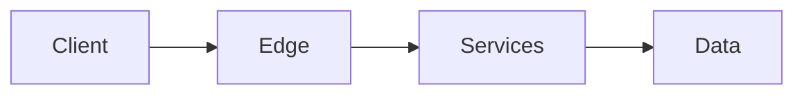

# Mermaid and Architecture DSL v1 interoperability



```architecture
{
  "version": 1,
  "title": "Commerce platform architecture",
  "description": "A three-zone commerce platform with users, edge services, application services, and data stores.",
  "canvas": { "width": 1600, "height": 900 },
  "elements": [
    {
      "type": "group",
      "id": "edge-zone",
      "x": 30,
      "y": 120,
      "width": 340,
      "height": 660,
      "title": "Edge",
      "layout": { "type": "column", "gap": 70, "padding": 50 },
      "children": [
        {
          "type": "node",
          "id": "user",
          "text": "Customer",
          "icon": "user"
        },
        {
          "type": "node",
          "id": "web",
          "text": "Web front end",
          "icon": "server"
        }
      ]
    },
    {
      "type": "group",
      "id": "service-zone",
      "x": 420,
      "y": 60,
      "width": 730,
      "height": 780,
      "title": "Application services",
      "layout": {
        "type": "grid",
        "columns": 2,
        "columnGap": 110,
        "rowGap": 44,
        "padding": 54
      },
      "children": [
        {
          "type": "node",
          "id": "gateway",
          "text": "API gateway",
          "icon": "api"
        },
        {
          "type": "node",
          "id": "catalog",
          "text": "Catalog API",
          "icon": "api"
        },
        {
          "type": "node",
          "id": "orders",
          "text": "Order service",
          "icon": "server"
        },
        {
          "type": "node",
          "id": "queue",
          "text": "Event queue",
          "icon": "server"
        },
        {
          "type": "node",
          "id": "cache",
          "text": "Cache",
          "icon": "database"
        },
        {
          "type": "node",
          "id": "worker",
          "text": "Order worker",
          "icon": "server"
        }
      ]
    },
    {
      "type": "group",
      "id": "data-zone",
      "x": 1200,
      "y": 120,
      "width": 370,
      "height": 660,
      "title": "Data",
      "layout": "column",
      "children": [
        {
          "type": "node",
          "id": "sql",
          "text": "Operational DB",
          "icon": "database",
          "shape": "ellipse"
        },
        {
          "type": "node",
          "id": "blob",
          "text": "Object storage",
          "icon": "cloud"
        }
      ]
    },
    {
      "type": "connector",
      "from": "user",
      "to": "web",
      "fromPort": "bottom",
      "toPort": "top",
      "routing": "orthogonal",
      "label": "HTTPS"
    },
    {
      "type": "connector",
      "from": "web",
      "to": "gateway",
      "fromPort": "right",
      "toPort": "left",
      "routing": "orthogonal"
    },
    {
      "type": "connector",
      "from": "gateway",
      "to": "catalog",
      "fromPort": "right",
      "toPort": "left",
      "routing": "orthogonal",
      "label": "read"
    },
    {
      "type": "connector",
      "from": "gateway",
      "to": "catalog",
      "fromPort": "right",
      "toPort": "left",
      "routing": "orthogonal",
      "label": "write"
    },
    {
      "type": "connector",
      "from": "gateway",
      "to": "orders",
      "fromPort": "bottom",
      "toPort": "top",
      "routing": "orthogonal"
    },
    {
      "type": "connector",
      "from": "catalog",
      "to": "cache",
      "fromPort": "bottom",
      "toPort": "right",
      "routing": "polyline",
      "points": [
        { "x": 1115, "y": 370 },
        { "x": 1115, "y": 592.6 },
        { "x": 819, "y": 592.6 },
        { "x": 819, "y": 696.6 }
      ]
    },
    {
      "type": "connector",
      "from": "catalog",
      "to": "sql",
      "fromPort": "right",
      "toPort": "left",
      "routing": "orthogonal",
      "label": "query"
    },
    {
      "type": "connector",
      "from": "orders",
      "to": "sql",
      "fromPort": "right",
      "toPort": "left",
      "routing": "orthogonal",
      "label": "transaction"
    },
    {
      "type": "connector",
      "from": "orders",
      "to": "queue",
      "fromPort": "right",
      "toPort": "left",
      "routing": "orthogonal"
    },
    {
      "type": "connector",
      "from": "queue",
      "to": "worker",
      "fromPort": "bottom",
      "toPort": "top",
      "routing": "orthogonal"
    },
    {
      "type": "connector",
      "from": "worker",
      "to": "blob",
      "fromPort": "right",
      "toPort": "left",
      "routing": "orthogonal",
      "label": "archive"
    }
  ]
}
```
