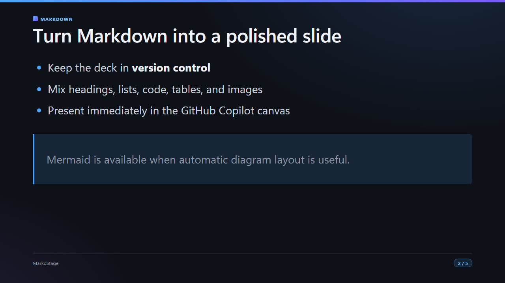
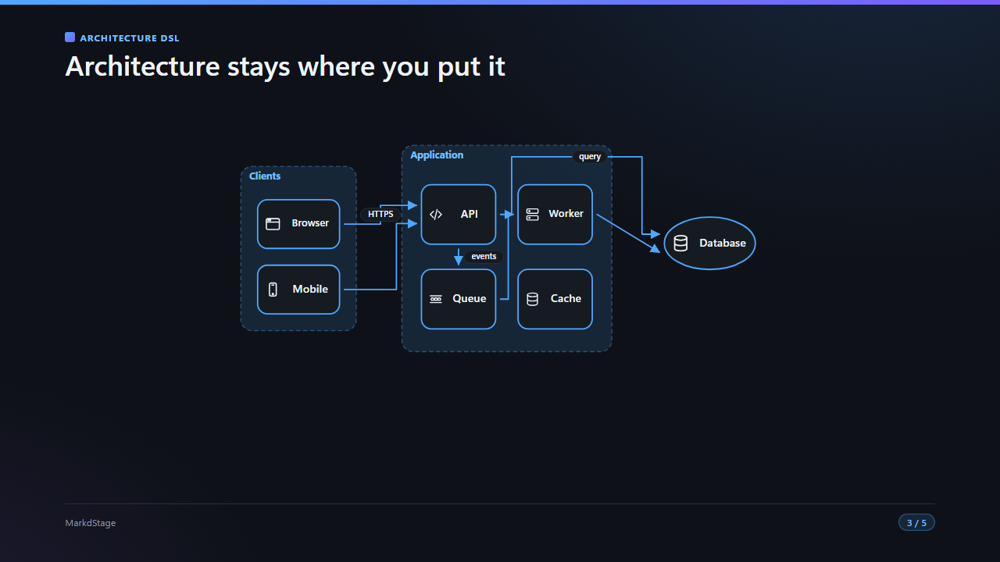
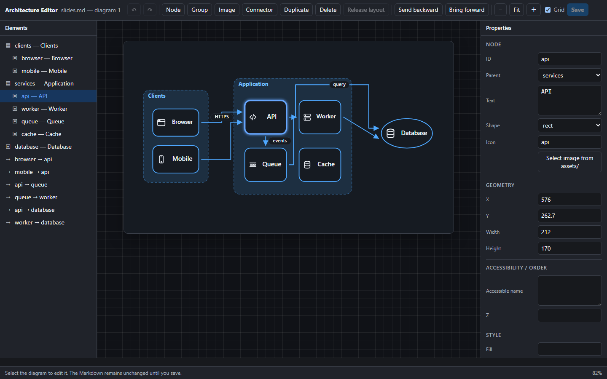

<p align="center">
  <a href="https://github.com/runceel/markdstage">
    
  </a>
</p>

<h1 align="center">MarkdStage</h1>

<p align="center">
  <strong>Markdown, ready for the stage.</strong>
</p>

<p align="center">
  <a href="./README.md">English</a>
</p>

<p align="center">
  <a href="https://github.com/runceel/markdstage/actions/workflows/ci.yml"></a>
  <a href="./LICENSE"></a>
  
  
</p>

<p align="center">
  <a href="#canvas-extension">Canvas Extension</a> |
  <a href="#desktop">Desktop</a> |
  <a href="#community-macos-app">macOS アプリ</a> |
  <a href="#examples">表示例</a> |
  <a href="#markdown-format">Markdown 形式</a> |
  <a href="#documentation">ドキュメント</a> |
  <a href="https://github.com/runceel/markdstage/releases">リリース</a>
</p>

MarkdStage は、Markdown をそのまま洗練されたスライドに変換するオープンソースのプレゼンテーションツールです。
編集、操作が同期するプレゼンテーション、スピーカーノート、PDF エクスポートに対応しています。
GitHub Copilot ネイティブの Canvas Extension とスタンドアロンの Windows アプリは同じレンダラーで描画するため、
最初の下書きから本番の登壇まで、Markdown を正本として扱えます。

## MarkdStage を選ぶ理由

- **Markdown がソース**: 独自形式に乗り換えず、`.md` をそのまま正本として使い続けられます
- **書いたらすぐに発表**: Canvas でも Desktop でも、ファイルを開けばそのままスライドになります
- **技術的な内容をそのまま見せられる**: コード、Mermaid、Architecture DSL、画像、表、スピーカーノートに対応します
- **どこで見ても同じ仕上がり**: Canvas、投影用ウィンドウ、Desktop、PDF を同じレンダラーで描画します
- **書き出す前に PDF への収まりを確認できる**: 固定 16:9 レイアウトをプレビューしてクリッピングを検出し、気になるページだけを画像で確かめられます
- **発表に集中できる操作**: ボタン、キーボード、対応環境では Surface Pen でスライドを送れます

<a id="examples"></a>

## Markdown をステージへ

GitHub Copilot Canvas、投影用ウィンドウ、Desktop アプリ、PDF エクスポートは、
すべて同じ Markdown レンダラーで描画されます。

<table>
  <tr>
    <td width="50%">
      
    </td>
    <td width="50%">
      
    </td>
  </tr>
  <tr>
    <td valign="top">
      <strong>標準 Markdown</strong><br>
      見出し、リスト、強調、コード、表、画像をそのまま書けます。図の配置を自動で任せたいときは
      Mermaid も使えます。
    </td>
    <td valign="top">
      <strong>Architecture DSL</strong><br>
      グループやアイコンの位置、コネクターの経路を固定したいときは、
      <code>architecture</code> フェンスに JSON を書きます。
    </td>
  </tr>
</table>

MarkdStage Canvas は、表示中のデッキと Architecture DSL を GitHub Copilot App のコンテキストに渡します。
そのため、描きたい図をことばで説明するだけで、Markdown の作成や修正を Copilot に任せられます。

画面上で図を編集したいときは、**More controls > Open Markdown** でソースの Markdown を読み込み、
**More controls > Shape editing > Advanced editing** から専用の Architecture Editor を開きます。
ノード、グループ、画像、コネクターの追加、削除、配置、確認ができます。
変更は下書きとして保持され、**Save** を選ぶと Markdown に書き戻されます。

<p align="center">
  
</p>

## MarkdStage の使い方

| 利用環境 | 用途 |
| --- | --- |
| **MarkdStage Canvas** | GitHub Copilot に Markdown の要約やスライド化を任せるか、**More controls > Open Markdown** から直接読み込みます |
| **MarkdStage Desktop** | GitHub Copilot を開かずに、Markdown、次のスライド、スピーカーノートを手元で見ながら Windows で発表します |
| **MarkdStage CLI** | Canvas を使わずに、ターミナル、CI、Codex、Claude Code から発表・検証・取得・エクスポートします |
| **MarkStageForMac** | コミュニティ製の macOS ネイティブアプリで発表します |

<a id="canvas-extension"></a>

## Canvas Extension を使う

このリポジトリをプロジェクトとして開くと、`.github/extensions/markdstage/` がプロジェクトスコープで
読み込まれます。別のリポジトリへユーザースコープでインストールする場合は、現在の
**[v2.3.0 リリース](https://github.com/runceel/markdstage/releases/tag/v2.3.0)** を指定して
GitHub Copilot に依頼します。

> 次の GitHub リポジトリフォルダーから MarkdStage をユーザースコープへインストールしてください。
>
> `https://github.com/runceel/markdstage/tree/v2.3.0/.github/extensions/markdstage`

Extension は利用者の環境でローカルのコードを実行します。インストールする前に中身を確認し、
同じ状態を再現できるよう、信頼できるリリースタグかコミット SHA を指定してください。
`main` ブランチは開発中の最新版です。

### 最小ワークフロー

1. `slides.md` を編集し、空行の後の `---` でスライドを区切ります。
2. Copilot に「`slides.md` を使ってこのデッキをプレゼンテーションしてください」と依頼します。
3. MarkdStage Canvas の **◀ ▶**、**矢印キー**、または **☰ スライド一覧**でスライドを送ります。
4. PDF に書き出す前に **More controls > Output preview** で確認します。Copilot に `inspect_layout` を先に実行させれば、確認が必要なページだけを PNG プレビューにできます。

Canvas の **More controls > Open Markdown** か `I` キーを使えば、AI を介さずにワークスペースの Markdown をそのまま開けます。
Git リポジトリではリポジトリルート、それ以外では現在のセッションで開いているフォルダーが
ワークスペースになります。`open_canvas` を直接呼び出す場合の Canvas ID は
**`MarkdStage`** です。

```text
canvasId: MarkdStage
```

<a id="desktop"></a>

## MarkdStage Desktop を使う

[MarkdStage Desktop](./apps/MarkdStage.Desktop/README.md) は、ファイルピッカーから Markdown を開く
WinUI 3 アプリです。現在のスライドと次のスライド、そのスライドのスピーカーノートを並べて表示し、
操作が同期するネイティブの投影用ウィンドウを開けます。

現在の **[v2.3.0 リリース](https://github.com/runceel/markdstage/releases/tag/v2.3.0)** には、
Windows x64 / ARM64 向けのポータブルビルドと SHA-256 チェックサムファイルが含まれます。

- [MarkdStage-win-x64.zip](https://github.com/runceel/markdstage/releases/download/v2.3.0/MarkdStage-win-x64.zip)
- [MarkdStage-win-arm64.zip](https://github.com/runceel/markdstage/releases/download/v2.3.0/MarkdStage-win-arm64.zip)

## CLI を使う

[MarkdStage CLI](./docs/user-guide/ja/cli.md) は Canvas なしで同じレンダラーを実行します。
ターミナル、CI、Codex、Claude Code でも Markdown デッキをそのまま扱えます。Node.js 24 以降と、
インストール済みの Microsoft Edge、Google Chrome、または Chromium が必要です。

```console
npx @markdstage/markdstage presentation slides.md
npx @markdstage/markdstage present slides.md --watch
npx @markdstage/markdstage validate slides.md --json
npx @markdstage/markdstage inspect slides.md
npx @markdstage/markdstage export slides.md --output slides.pdf
```

`presentation` は発表者用ダッシュボードを開きます。そこで **Start presentation** を選ぶと、
同期された観客向けウィンドウが開きます。

`present --watch` は表示モードで開始し、鉛筆の配置エディターと詳細な Architecture デザイナーを
有効にします。保存時は対応する Markdown フェンスをアトミックに更新します。`--watch` のない
`present` は読み取り専用です。

`markdstage skill install --target codex` と `--target claude` は、Canvas の `markdstage_guide`
ツールと同じガイドから生成した Agent Skills を書き出します。

<a id="community-macos-app"></a>

## コミュニティ製 macOS アプリ

[MarkStageForMac](https://github.com/07JP27/MarkStageForMac) は、MarkdStage コミュニティが
開発した macOS ネイティブアプリです。

<a id="markdown-format"></a>

## Markdown 形式

```markdown
---
title: Sample
theme: dark
layout: title
---

# Markdown, ready for the stage.

---

## Second slide

- Use standard Markdown
- Write code and Mermaid directly
```

先頭のフロントマターがデッキ全体の設定になります。各スライドのフロントマターでは、
`layout`、`size`、`theme` などを個別に上書きできます。スピーカーノートは、コードフェンスの外側で
スライドに直接書いた HTML コメントに記述します。発表者ビューにだけ表示されます。

## リポジトリ構成

| パス | 内容 |
| --- | --- |
| `.github/extensions/markdstage/` | Canvas Extension、レンダラー、同梱オープンソースソフトウェア、スキーマ |
| `.github/skills/markdstage/SKILL.md` | Markdown をスライド断片へ整形して MarkdStage を開く Skill |
| `packages/markdstage-cli/` | `@markdstage/markdstage` CLI パッケージと Agent Skills の生成 |
| `apps/MarkdStage.Desktop/` | WinUI 3 Desktop アプリ |
| `assets/brand/` | MarkdStage のロゴ、ロックアップ、README バナー |
| `assets/readme/` | この README に掲載しているスライドと Architecture Editor の画像 |
| `slides.md` | 機能を紹介するサンプルデッキ |

## v2.0.0 の破壊的変更

MarkdStage への移行にあたり、旧ブランド名の互換エイリアスは用意していません。

| 変更前 | 変更後 |
| --- | --- |
| Canvas ID `presentation` | Canvas ID `MarkdStage` |
| ツール `presentation_guide` | ツール `markdstage_guide` |
| `.github/extensions/presentation/` | `.github/extensions/markdstage/` |
| `.github/skills/presentation/` | `.github/skills/markdstage/` |
| `Presentation-win-*.zip` | `MarkdStage-win-*.zip` |

既存の Markdown 構文、テーマ、Architecture DSL、`load_deck` や `goto_slide` などの
アクション仕様は変更していません。

<a id="documentation"></a>

## ドキュメント

- [ユーザーガイド](./docs/user-guide/ja/README.md)
- [GitHub Copilot とスライドを作成する](./docs/user-guide/ja/ai-assisted-authoring.md)
- [GitHub Copilot ハンズオン](./docs/user-guide/ja/copilot-hands-on.md)
- [MarkdStage Skill](./.github/skills/markdstage/SKILL.md)
- [Canvas Extension の仕様とアクション](./.github/extensions/markdstage/README.md)
- [MarkdStage Desktop](./apps/MarkdStage.Desktop/README.md)
- [MarkdStage CLI](./docs/user-guide/ja/cli.md)
- [カスタムテーマ作成](./.github/extensions/markdstage/docs/custom-theme-authoring.md)
- [プロダクト原則](./PRODUCT.md)
- [ブランドとデザインシステム](./DESIGN.md)
- [リリース手順](./.github/RELEASING.md)
- [サードパーティ通知](./.github/extensions/markdstage/THIRD-PARTY-NOTICES.md)
- [MIT ライセンス](./LICENSE)

## ライセンス

このリポジトリの独自部分は MIT License で公開しています。同梱しているオープンソースソフトウェアの
ライセンスと著作権表示は、
[THIRD-PARTY-NOTICES.md](./.github/extensions/markdstage/THIRD-PARTY-NOTICES.md) を参照してください。
