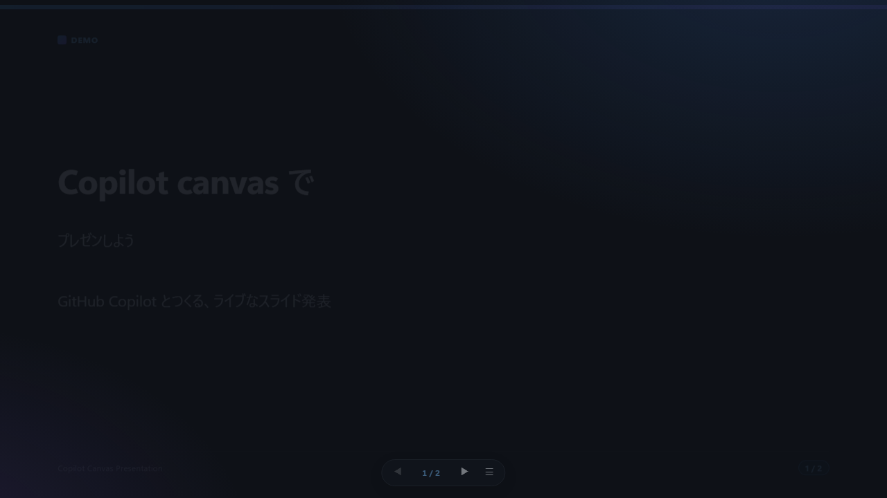
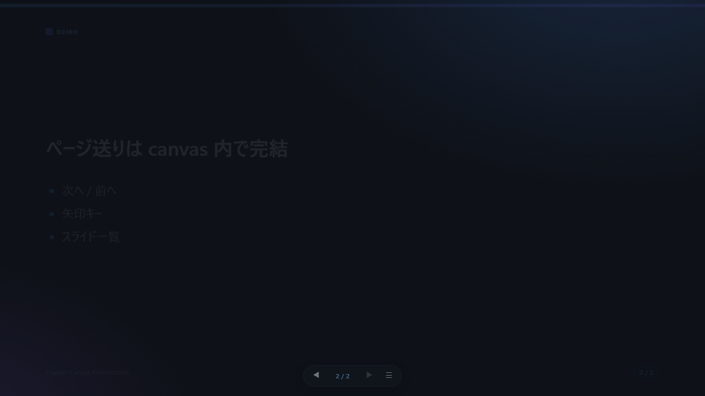

# Copilot Canvas Presentation

GitHub Copilot の canvas を使って、Markdown からライブにスライドプレゼンを行うための環境です。
`slides.md` を元にプレゼンを開始すると、最初のスライドがすぐ表示され、以降のページ送りは canvas 内の操作で完結します。
**Mermaid 記法の図**や、リモート / ローカル（`assets/`）の**画像挿入**にも対応しています。
配色は **dark（既定）/ light / microsoft** の 3 テーマから選べます。

## セットアップ

必要なものは GitHub Copilot アプリだけです（このリポジトリを開いて使います）。

プレゼンは **presentation canvas 拡張機能**（`.github/extensions/presentation/`）が表示するため、追加のインストールやサーバー起動は不要です。

## 使い方

1. このリポジトリを GitHub Copilot アプリで開きます。
2. スライドの内容を [`slides.md`](./slides.md) に書きます。`---` の行がスライドの区切りです。
3. Copilot にこう伝えます:

   > slides.md に従ってプレゼンしてください。

4. canvas にスライドが表示されます。あとは canvas 内の **◀ ▶ ボタン**、**矢印キー**、**☰ スライド一覧**でページを送ります。

`slides.md` を編集したあとの再実行も、同じ依頼文で進められます。

## 表示イメージ

**スライド表示（1枚目）**

**スライド表示（2枚目）**

仕組みやスキルの詳細は [`.github/skills/presentation/SKILL.md`](./.github/skills/presentation/SKILL.md) を、canvas 拡張機能の詳細は [`.github/extensions/presentation/README.md`](./.github/extensions/presentation/README.md) を参照してください。

## ライセンス

[MIT License](./LICENSE)
