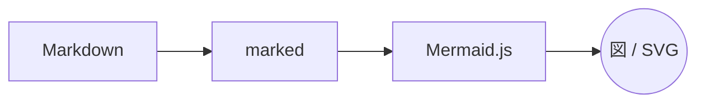

# Copilot canvas で<br>プレゼンしよう

GitHub Copilot とつくる、ライブなスライド発表

---

## このプレゼンの仕組み

- スライドは **Markdown**（このファイル）に書く
- Copilot は開始時に **全スライドをまとめて生成**して登録
- **HTML 変換・装飾は presentation canvas 拡張機能**が担当
- ページ送りは **インデックス指定だけ**だから **速い** ⚡

---

## ページ送りは ask_user で

- **次へ ▶** / **◀ 前へ** で 1 枚ずつ移動
- **スライド一覧 ☰** から任意のスライドへジャンプ
- **再読み込み ↻** で表示を作り直し
- **終了 ✖** で発表を終える

> 発表者は選択肢を選ぶだけ。スライドは Copilot が生成します。

---

## コードもきれいに表示

```js
// 開始時に全スライドを一括登録
await invokeCanvasAction("presentation", "load_deck", {
  slides: [slide1, slide2, slide3],
});
// ページ送りはインデックスを渡すだけ
await invokeCanvasAction("presentation", "goto_slide", { index: 1 });
```

`load_deck` で全スライドを登録し、`goto_slide` でスムーズに切り替えます。

---

## はじめかた

1. このリポジトリで Copilot にこう伝える:
   - 「**slides.md に従ってプレゼンしてください**」
2. canvas にスライドが表示される
3. あとは選択肢でページを送るだけ 🎉

---

## 図も画像も使える




- 図は **Mermaid 記法**（` ```mermaid ` ブロック）でそのまま描ける
- 画像は **リモート URL** か、`assets/` に置いた**ローカルファイル**で挿入

---

# ありがとうございました

質問やフィードバックをどうぞ！
