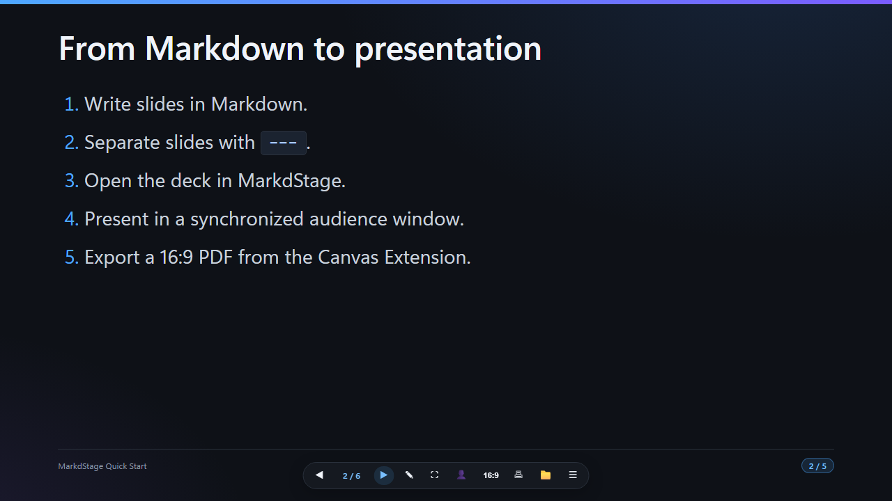
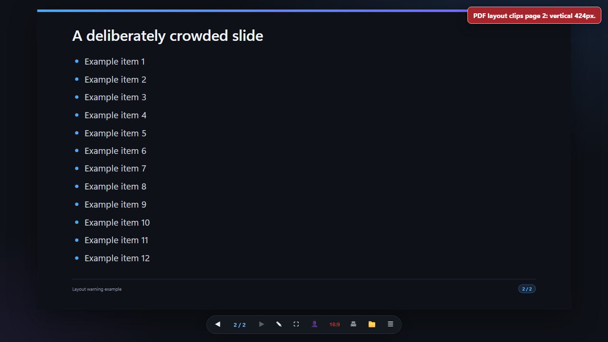

# Create slides with GitHub Copilot

> 日本語版: [日本語](ja/ai-assisted-authoring.md)

MarkdStage is designed to use GitHub Copilot App as an authoring partner. Markdown remains the
source of truth, while MarkdStage provides the syntax references, schemas, rendered deck state, and
output diagnostics that Copilot needs to create and refine slides in the same chat session.



## Information available to Copilot

MarkdStage exposes focused information instead of requiring Copilot to infer the presentation
format from screenshots alone.

| Information | How it helps authoring |
| --- | --- |
| Slide format guidance | Describes slide separators, front matter, layouts, content sizes, speaker notes, and supported Markdown |
| Theme guidance | Describes the built-in themes and how to select them |
| Custom theme guidance and schema | Defines supported CSS custom properties, metadata, assets, and security restrictions |
| Architecture DSL guidance and schema | Defines elements, layouts, icons, connectors, limits, and validation rules |
| Current deck content | Keeps the Markdown being displayed available as the material to revise |
| Architecture validation | Returns structured errors with the affected slide, diagram block, JSON path, and remediation |
| Fixed 16:9 layout diagnostics | Identifies clipped pages and reports overflow measurements and relevant elements |
| Targeted slide images | Produces 1280x720 images for selected or problematic pages when visual inspection is necessary |

While the Canvas is open, the active deck and Architecture DSL are available in GitHub Copilot App
context. When additional detail is needed, Copilot can retrieve the focused references and
diagnostics listed above.

The `markdstage_guide` tool provides the authoring references through focused topics such as
`slide-format`, `themes`, `custom-themes`, `theme-schema`, `architecture-dsl`, and
`architecture-schema`. Canvas actions provide Architecture validation, fixed-layout diagnostics,
and selected slide captures.

These capabilities allow Copilot to work from the Markdown grammar and structured measurements
first, then use images only for issues that require visual judgment.

With a sufficiently specific request, Copilot can complete most of the create-render-review loop
through chat, while every change remains reviewable in the Markdown source and the rendered Canvas.

For a complete recorded example, follow
[Hands-on: build a deck with GitHub Copilot](copilot-hands-on.md).

## Recommended authoring workflow

1. **Provide the source and objective.** Identify the source file or notes, intended audience,
   presentation purpose, preferred theme, and approximate length.
2. **Create the complete Markdown deck.** Copilot can consult the MarkdStage guidance, write the
   slide fragments, and open the full deck in Canvas.
3. **Review the rendered result.** Check the flow, density, diagrams, speaker notes, and terminology
   in the active deck.
4. **Validate structured content.** Architecture DSL can be checked for schema, reference, and
   placement errors before visual review.
5. **Inspect fixed 16:9 output.** Layout diagnostics identify pages that clip in PDF-equivalent
   output and provide measurements that can guide revisions.
6. **Capture only the pages that need visual analysis.** Targeted PNG files help Copilot assess
   balance, spacing, or diagram appearance without generating images for the complete deck.
7. **Revise and repeat.** Copilot updates the Markdown, reloads the deck, and rechecks the affected
   pages until the result is ready to present or export.

```text
Source and objective
  → MarkdStage guidance and schemas
  → Markdown deck
  → Rendered Canvas
  → Structured validation and 16:9 diagnostics
  → Targeted slide images when needed
  → Markdown revision
  → Presentation or PDF
```

## Write effective requests

Include the information that affects the deck's structure and visual direction:

- The source material or Markdown path
- The audience and presentation objective
- The expected duration or slide count
- The preferred theme or brand constraints
- Required sections, diagrams, notes, or terminology
- Whether the deck must be validated for fixed 16:9 PDF output

### Create a deck from source material

```text
Create an eight-slide architecture review from proposal.md.
Use the Microsoft theme, add speaker notes, and use Architecture DSL for the system overview.
Open the complete deck in MarkdStage and correct any 16:9 clipping before export.
```

### Revise an existing deck

```text
Review slides.md for a technical audience.
Reduce dense slides, keep the current section order, and preserve all code examples.
Reopen the complete deck and check the fixed 16:9 layout after the revision.
```

### Improve a specific diagram

```text
Update the Architecture DSL on slide 4 so the service boundary and data flow are easier to follow.
Validate the diagram, render the slide, and revise the placement if labels or connectors overlap.
```

### Investigate output problems

```text
Inspect this deck for PDF-equivalent clipping.
Fix the affected Markdown pages and capture only the pages that still require visual review.
```

## Understand the validation tools

### Architecture validation (`get_architecture_errors`)

Architecture validation reports machine-readable errors for the complete deck or a selected slide.
Copilot can use the affected page, Architecture block, JSON path, and remediation to update the
source without relying on trial and error.

### Fixed 16:9 inspection (`inspect_layout`)

The fixed-layout inspection renders the PDF-equivalent 1280x720 surface and reports pages that
overflow. Diagnostics include vertical and horizontal overflow and a bounded list of elements near
the problem.



The report is intended to answer whether content fits. It does not replace editorial review of
clarity, hierarchy, or visual balance.

### Targeted slide capture (`capture_slides`)

Slide capture generates PNG files for explicitly selected pages. When no pages are specified,
MarkdStage can inspect the deck first and capture only pages with clipping problems. The resulting
files stay in the workspace and can be reviewed by Copilot in the same session.

Use captures after structured diagnostics, not as the default way to inspect every page.

## Review responsibilities

AI-assisted authoring shortens the create-render-review loop, but the author remains responsible
for the final deck.

- Verify facts, names, code, and confidential information in the Markdown source.
- Confirm that speaker notes contain appropriate presenter-only content.
- Review diagrams for technical meaning, not only schema validity.
- Review every exported PDF page before distribution.
- Keep the source file under version control when the deck is part of a project.

The AI-facing authoring and validation capabilities are provided by the Canvas Extension.
MarkdStage Desktop focuses on presenting an existing deck.

## Related guides

- [Hands-on: build a deck with GitHub Copilot](copilot-hands-on.md)
- [Canvas Extension](canvas-extension.md)
- [Markdown authoring](markdown-authoring.md)
- [Themes and layouts](themes-and-layouts.md)
- [Diagrams and media](diagrams-and-media.md)
- [Presenting and export](presenting-and-export.md)
