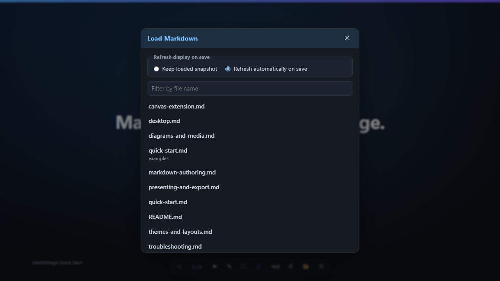
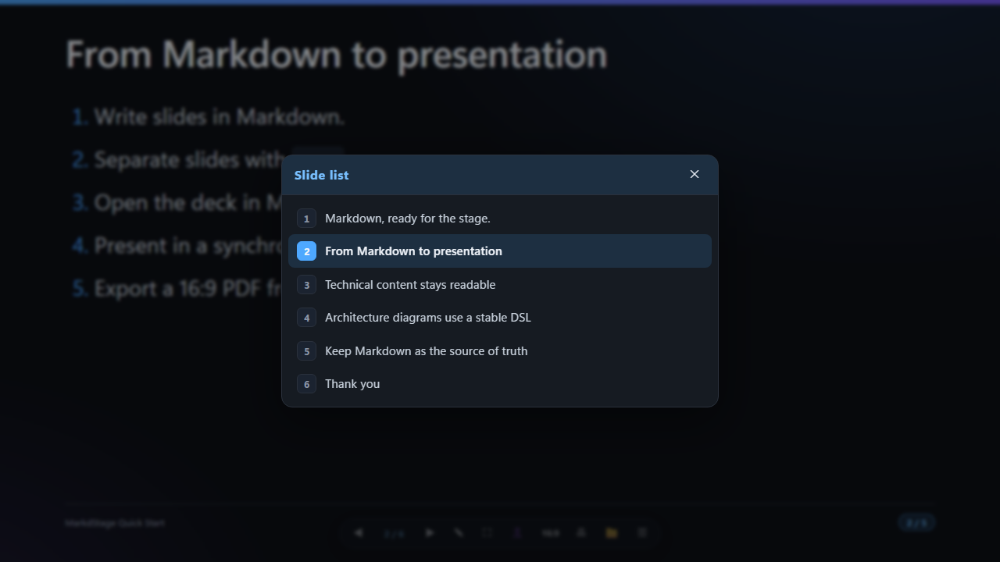
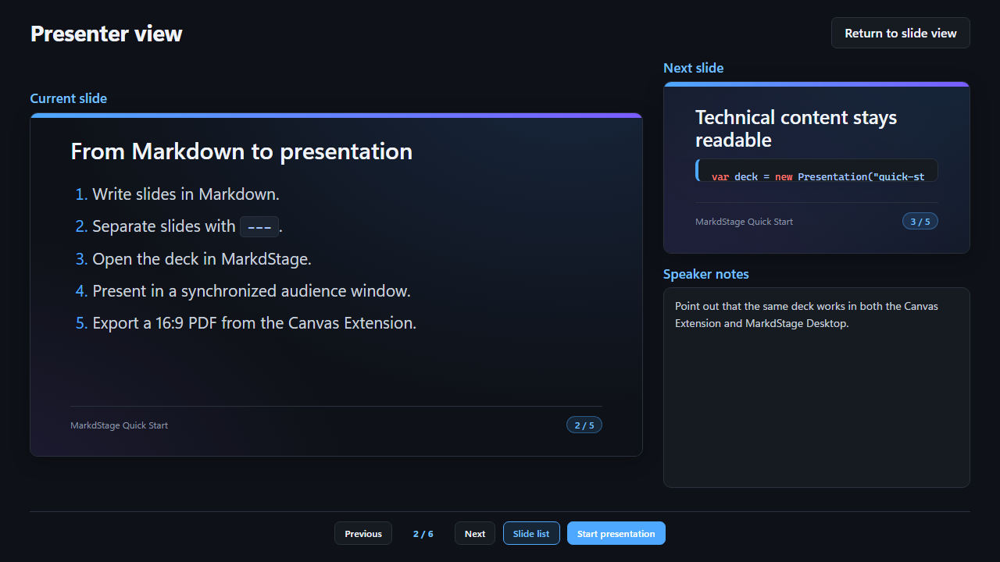

# Canvas Extension

> 日本語版: [日本語](ja/canvas-extension.md)

The MarkdStage Canvas Extension opens a complete Markdown deck inside GitHub Copilot. It is the
authoring-focused surface: you can ask Copilot to revise Markdown, import files directly, edit
Architecture diagrams, validate the fixed output layout, and export a PDF.

## Install the extension

See the [installation guide](installation.md) for project-scope and user-scope installation.

## Open a deck

Ask Copilot to present a workspace-relative Markdown path:

```text
Present this deck using docs/user-guide/examples/quick-start.md.
```

You can also select **More controls > Open Markdown** or press `I` to load Markdown without using
AI.



The import picker lists workspace `.md` and `.markdown` files and offers two modes:

| Mode | Behavior |
| --- | --- |
| **Keep loaded snapshot** | Keeps the imported deck unchanged until you reload or switch modes |
| **Refresh automatically on save** | Watches the source file, reloads valid saves, and preserves the current slide when possible |

If a watched file becomes empty, unreadable, or invalid, MarkdStage keeps the last valid deck. A
later valid save recovers automatically.

## Create and revise with Copilot

MarkdStage can provide Copilot with slide-format and theme guidance, Architecture DSL schemas,
structured validation errors, fixed 16:9 layout diagnostics, and images of selected problem pages.
This supports an iterative workflow in which Copilot writes Markdown, opens the deck, inspects the
result, and revises the source in the same session.

See [Create slides with GitHub Copilot](ai-assisted-authoring.md) for the recommended workflow and
prompt examples. For a complete prompt-to-PDF exercise, follow the
[GitHub Copilot hands-on](copilot-hands-on.md).

## Use the control bar


| Control | Action |
| --- | --- |
| **◀ / ▶** | Move to the previous or next slide |
| **Page counter** | Show the current page and total pages |
| **☰** | Open the slide list |
| **⋯** | Open More controls for presentation, view/edit, and file actions |

More controls contains:

- **Present:** External window and Presenter view
- **View & edit:** Shape editing and Output preview
- **File:** Open Markdown, Automatic refresh, Export PDF, and Export PowerPoint

Hover over a control to see its tooltip and keyboard hint.

## Navigate

- Select **◀** or **▶**.
- Press `Left` or `Right`.
- Left-click or tap an empty slide margin to advance.
- Right-click an empty slide margin to go back.
- Press `Home` or `End` to jump to the first or last slide.
- Select **☰** or press `O` to open the slide list.

Interactive slide content, links, images, and controls keep their normal click behavior.



## Use presenter view

Presenter view keeps the current slide large and places the next slide and speaker notes beside it.
Its controls can navigate, open the slide list, and start or end the external presentation.



Speaker notes come from top-level HTML comments in the current slide. They do not appear on the
audience slide or in the exported PDF.

## Open the audience window

Select **More controls > External window** to open a movable, resizable 1280x720 audience window.
Move it to the presentation display and press `F11` for fullscreen. The canvas, presenter view, and
audience window remain on the same slide.

Closing the canvas also closes the audience window.

## Validate and export

Use **More controls > Output preview** before export. It renders the same fixed 1280x720 layout
used by PDF output and warns when content is clipped. See
[Presenting and export](presenting-and-export.md) for the complete workflow.

## Canvas-only features

The following features are not available in MarkdStage Desktop:

- PDF export and PDF-equivalent clipping checks
- Lightweight Architecture placement editing
- Advanced Architecture Editor
- Direct AI-driven deck creation and revision

[Next: MarkdStage Desktop →](desktop.md)
