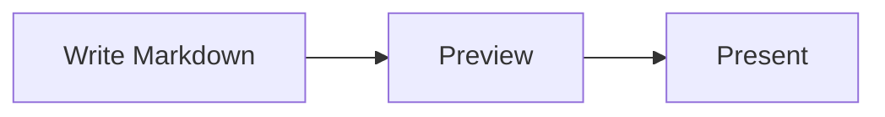
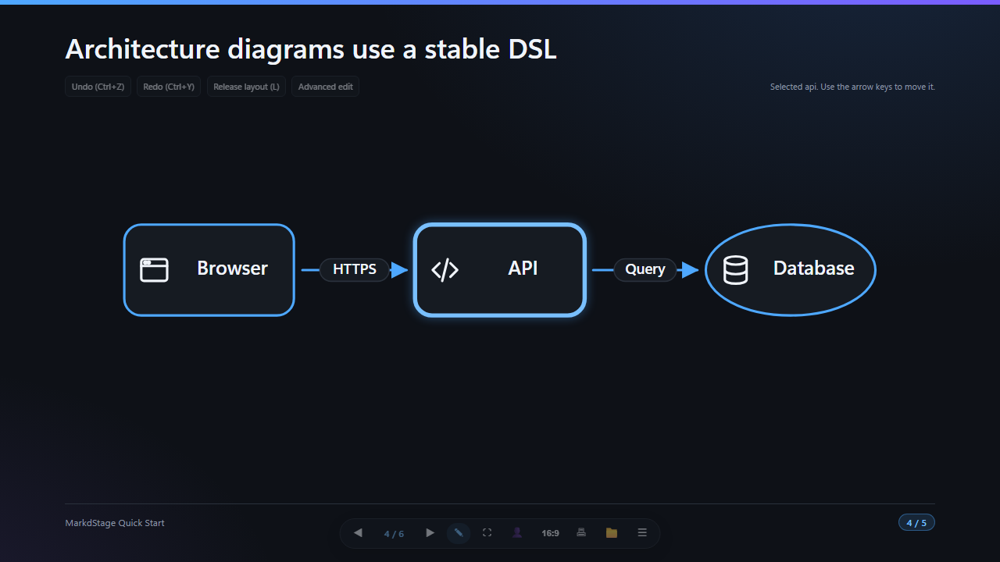
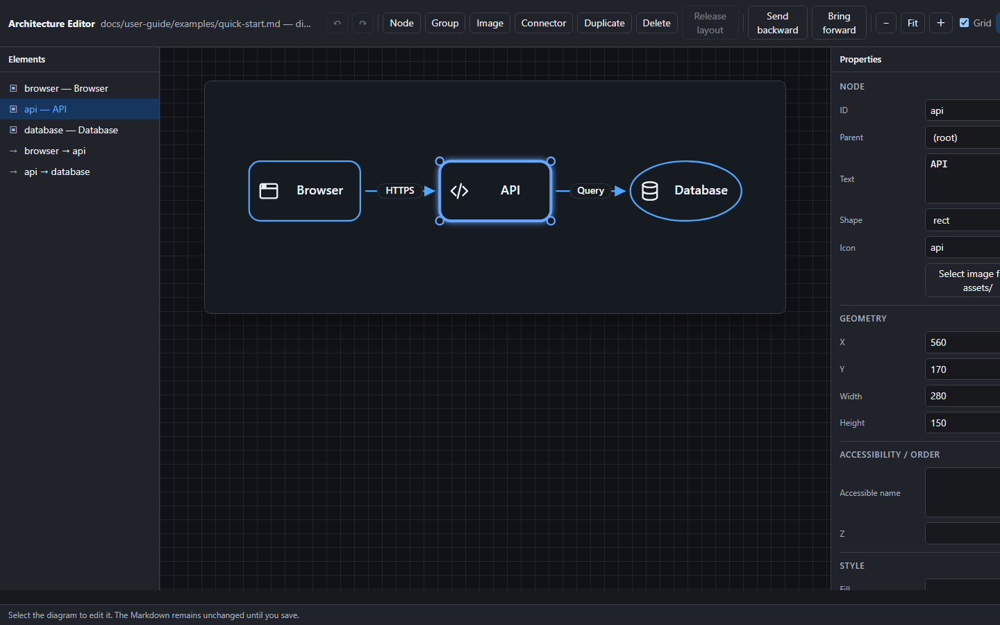

# Diagrams and media

> 日本語版: [日本語](ja/diagrams-and-media.md)

MarkdStage supports Markdown images, Mermaid for automatic layout, and Architecture DSL for stable
placement and routing.

## Use Mermaid for automatic layout

Write a `mermaid` fence:

````markdown

````

Mermaid is bundled and works offline. Use it for flowcharts, sequence diagrams, class diagrams, pie
charts, and other automatically arranged diagrams.

If Mermaid syntax is invalid, the slide shows an error while preserving the rest of the content.

## Use Architecture DSL for stable placement

Write JSON in an `architecture` fence when element positions, dimensions, containers, or connector
routes must remain stable:

````markdown
```architecture
{
  "version": 1,
  "canvas": { "width": 1200, "height": 500 },
  "elements": [
    {
      "type": "node",
      "id": "client",
      "x": 80,
      "y": 160,
      "width": 260,
      "height": 140,
      "text": "Client",
      "icon": "browser"
    },
    {
      "type": "node",
      "id": "api",
      "x": 700,
      "y": 160,
      "width": 260,
      "height": 140,
      "text": "API",
      "icon": "api"
    },
    {
      "type": "connector",
      "from": "client",
      "to": "api",
      "routing": "orthogonal",
      "label": "HTTPS"
    }
  ]
}
```
````

Nodes support rectangle, rounded rectangle, and ellipse shapes. Groups support row, column, grid,
and layered layouts. Connectors support straight, orthogonal, and polyline routing.

## Adjust placement in the Canvas Extension

Select **More controls > Shape editing** to enter the lightweight placement editor. Select an
element, drag it, or use the arrow keys. The editor provides Undo, Redo, layout release, and an
**Advanced edit** entry point.



For Markdown imported with **More controls > Open Markdown**, placement changes are saved back to
the source Architecture block. Decks created directly in the canvas keep changes in canvas state.

Leave edit mode before presenting.

## Use the Advanced Architecture Editor

Select **Advanced edit** from placement mode to open the dedicated editor.



The editor can:

- Add, duplicate, reorder, and delete nodes, groups, images, and connectors
- Change text, shape, icon, position, size, style, ports, routing, and parent group
- Apply or release group layouts
- Select or import assets
- Undo and redo draft changes

Changes remain a draft until you select **Save**. If the Markdown changes externally, the editor
does not overwrite it; reload the source and reapply the intended change.

Advanced editing requires a source-backed deck imported through **More controls > Open Markdown**
and an existing `architecture` block. An empty block is valid and can be populated by the editor:

````markdown
```architecture
```
````

## Add images

Standard Markdown images use `/assets/...`:

```markdown

```

Architecture icons and standalone images omit the leading slash:

```json
{
  "type": "image",
  "id": "map",
  "src": "assets/map.svg",
  "fit": "contain",
  "ariaLabel": "Regional system map",
  "x": 80,
  "y": 80,
  "width": 720,
  "height": 420
}
```

Use `contain`, `cover`, or `stretch` for Architecture image fitting. Supported local formats are
SVG, PNG, WebP, JPEG, and JPG.

[Next: Presenting and export →](presenting-and-export.md)
