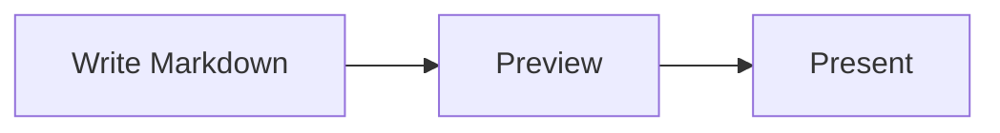

# Markdown, ready for the stage.

Create, review, and present one Markdown file.

<!--
Welcome the audience and explain that the Markdown file remains the source of truth.
-->

---

## From Markdown to presentation

1. Write slides in Markdown.
2. Separate slides with `---`.
3. Open the deck in MarkdStage.
4. Present in a synchronized audience window.
5. Export a 16:9 PDF from the Canvas Extension.

<!--
Point out that the same deck works in both the Canvas Extension and MarkdStage Desktop.
-->

---

## Technical content stays readable

```csharp
var deck = new Presentation("quick-start.md");
deck.Present();
```



---

## Architecture diagrams use a stable DSL

```architecture
{
  "version": 1,
  "title": "Quick-start architecture",
  "description": "A browser calls an API that stores data in a database.",
  "canvas": { "width": 1400, "height": 520 },
  "elements": [
    {
      "type": "node",
      "id": "browser",
      "x": 80,
      "y": 170,
      "width": 280,
      "height": 150,
      "text": "Browser",
      "icon": "browser"
    },
    {
      "type": "node",
      "id": "api",
      "x": 560,
      "y": 170,
      "width": 280,
      "height": 150,
      "text": "API",
      "icon": "api"
    },
    {
      "type": "node",
      "id": "database",
      "x": 1040,
      "y": 170,
      "width": 280,
      "height": 150,
      "text": "Database",
      "icon": "database",
      "shape": "ellipse"
    },
    {
      "type": "connector",
      "from": "browser",
      "to": "api",
      "routing": "orthogonal",
      "label": "HTTPS"
    },
    {
      "type": "connector",
      "from": "api",
      "to": "database",
      "routing": "orthogonal",
      "label": "Query"
    }
  ]
}
```

<!--
Use the Architecture Editor when exact placement and routing matter.
-->

---
layout: section
---

## Keep Markdown as the source of truth

---
layout: backcover
---

# Thank you
