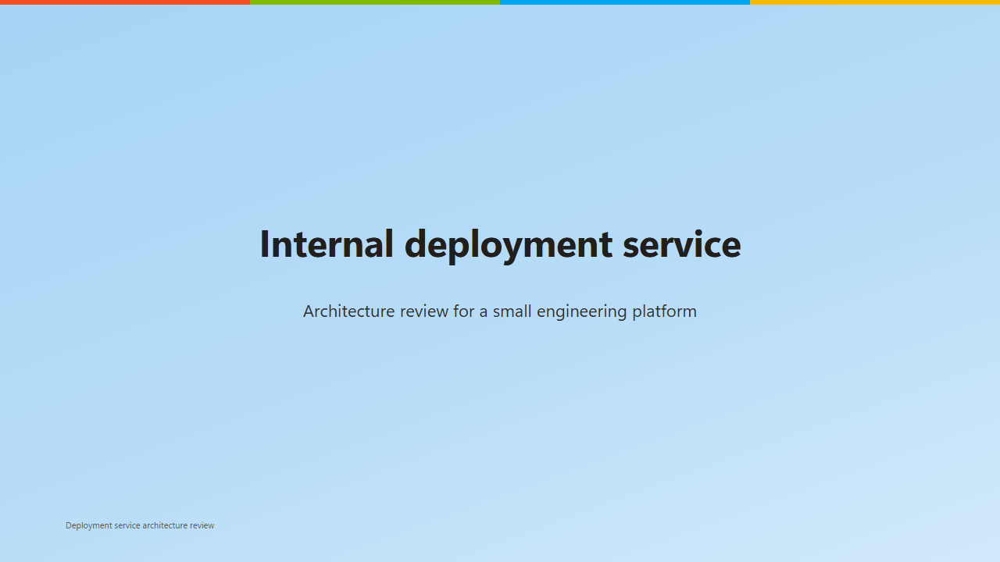
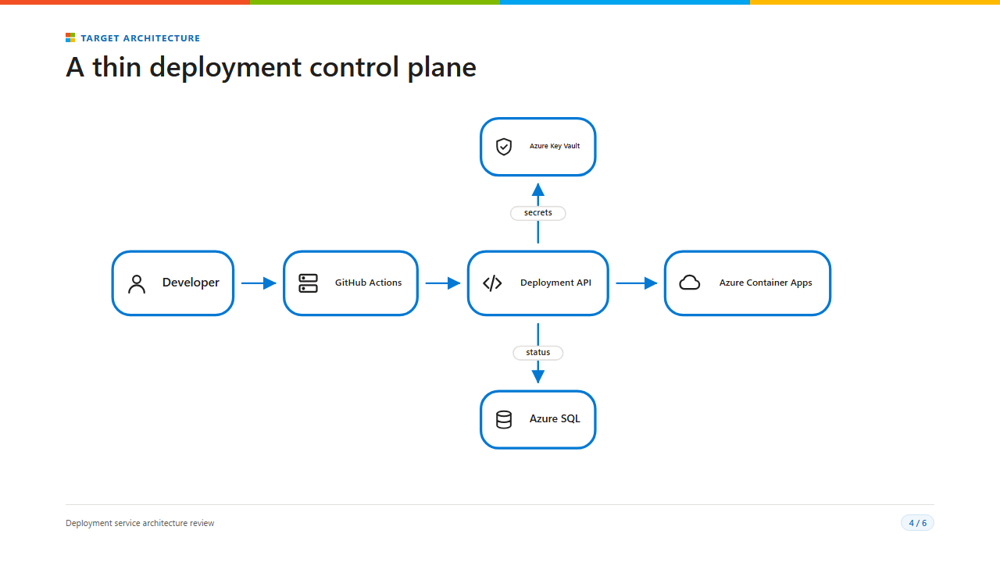

# ハンズオン: GitHub Copilot でデッキを作成する

> English version: [English](../copilot-hands-on.md)

この演習では、最初の依頼から検証済みの Markdown デッキ、対象スライドの画像、PDF 出力までを、
記録済みの GitHub Copilot セッションに沿って実施します。
[GitHub Copilot とスライドを作成する](ai-assisted-authoring.md)を確認した後に、
作成、表示、確認の一連のワークフローを実践してください。

## 作成するもの

この例では、社内デプロイサービスに関する6枚のアーキテクチャレビュー資料を作成します。

- Microsoft テーマ
- 簡潔なスピーカーノート
- Architecture DSL によるシステム構成図
- Architecture の検証エラーなし
- 固定 16:9 のクリッピングなし
- 選択したスライドの PNG 画像
- 16:9 PDF

記録した出力はこのリポジトリに含まれています。

- [生成された Markdown デッキ](../examples/copilot-hands-on-result.md)
- [エクスポートされた PDF](../examples/copilot-hands-on-result.pdf)

同じ依頼を再実行した場合、生成結果が変わることがあります。バイト単位で同じ出力になることを
前提とせず、Markdown と表示されたスライドを確認してください。

## 前提条件

- MarkdStage Canvas Extension がインストールされたワークスペースを開きます。
- GitHub Copilot がワークスペース内にファイルを作成できることを確認します。
- 表示結果を確認できるように、MarkdStage Canvas を開いた状態にします。

## 1. 作成要件をまとめて依頼する

記録した独立 GitHub Copilot セッションでは、次の英語プロンプトを使用しました。

```text
Create a six-slide architecture review deck at `docs/user-guide/examples/copilot-hands-on-result.md` for engineering leaders who are evaluating a small internal deployment service.

Use the Microsoft theme and add concise speaker notes to content slides. Include these topics: title, problem and objective, requirements, target architecture, rollout plan, and risks with next steps. Use MarkdStage Architecture DSL for the target architecture. The target flow is: Developer -> GitHub Actions -> Deployment API -> Azure Container Apps, with Deployment API also reading secrets from Azure Key Vault and writing release status to Azure SQL.

Open the complete deck in MarkdStage. Validate the Architecture DSL, inspect the fixed 16:9 layout, and correct every validation or clipping issue. Capture the title slide and architecture slide, plus any slide that still needs visual review, under `docs/user-guide/images/copilot-hands-on/`. Export the final deck to `docs/user-guide/examples/copilot-hands-on-result.pdf`.

Keep Markdown as the source of truth. Do not change existing product or manual files outside the requested example output and capture directory.
```

日本語で依頼する場合は、次のように同じ要件を指定できます。

```text
小規模な社内デプロイサービスを評価するエンジニアリングリーダー向けに、6枚のアーキテクチャレビュー資料を `docs/user-guide/examples/copilot-hands-on-result.md` として作成してください。

Microsoft テーマを使用し、本文スライドには簡潔なスピーカーノートを追加してください。タイトル、課題と目的、要件、目標アーキテクチャ、展開計画、リスクと次のステップを含めてください。目標アーキテクチャには MarkdStage Architecture DSL を使用してください。処理の流れは Developer -> GitHub Actions -> Deployment API -> Azure Container Apps です。Deployment API は Azure Key Vault からシークレットを読み取り、Azure SQL にリリース状態を書き込みます。

デッキ全体を MarkdStage で開いてください。Architecture DSL を検証し、固定 16:9 レイアウトを検査して、検証エラーまたはクリッピングをすべて修正してください。タイトルスライドとアーキテクチャスライド、および視覚的な確認が引き続き必要なスライドを `docs/user-guide/images/copilot-hands-on/` に画像として保存してください。最終デッキを `docs/user-guide/examples/copilot-hands-on-result.pdf` にエクスポートしてください。

Markdown を信頼できる唯一の情報源として維持してください。指定したサンプル出力と画像ディレクトリ以外の既存の製品ファイルまたはマニュアルファイルは変更しないでください。
```

この依頼には、対象者、スライド枚数、テーマ、必要な内容、図に含める事実、出力先、
完了条件が含まれています。そのため、利用者が MarkdStage の各アクションを個別に指定しなくても、
Copilot がデッキの作成と確認を進められます。

## 2. Canvas でデッキを確認する

Copilot は Markdown ファイル全体を作成し、MarkdStage でデッキを開きます。
修正を依頼する前に、次の項目を確認します。

1. スライド一覧で、依頼したトピックが正しい順序で含まれていることを確認します。
2. Architecture スライドに、プロンプトで指定したすべてのシステムと接続が含まれることを確認します。
3. Presenter view を開き、スピーカーノートが表示内容を適切に補足していることを確認します。
4. 表現、事実、構成を直接確認する場合は、Markdown ファイルも開いた状態にします。

Markdown ファイルが信頼できる唯一の情報源です。Canvas は表示結果を確認するためのサーフェスであり、
別のプレゼンテーションファイルではありません。

## 3. Copilot に出力を検証させる

このプロンプトでは、Copilot に3種類の確認を依頼しています。

| 確認 | 期待する根拠 |
| --- | --- |
| Architecture の検証 | スキーマ、参照、配置に関するエラーが残っていない |
| 固定 16:9 の検査 | PDF 相当の 1280x720 サーフェスを超えるページがない |
| 対象を限定した視覚確認 | 指定したページまたは未解決のページだけに PNG が作成される |

画像を確認する前に、構造化された検証を実施します。16:9 に収まるスライドでも編集上の修正が
必要な場合があるため、生成された画像で情報の階層、バランス、ラベル、読みやすさを確認してください。

## 4. 記録した結果と比較する

この例は2026年8月31日に、独立したワークツリーセッションで `gpt-5.6-luna` と
medium reasoning を使用して実行しました。

| 結果 | 記録値 |
| --- | --- |
| 作成したスライド | 6枚 |
| 表示されたページ | 自動追加される裏表紙を含む7ページ |
| 最終的な Architecture の検証 | エラー0件 |
| 最終的な固定 16:9 の検査 | クリップされたページ0件、全7ページが範囲内 |
| 画像化したページ | 1ページ目（タイトル）と4ページ目（目標アーキテクチャ） |
| エクスポートした PDF | `../examples/copilot-hands-on-result.pdf`、148,526バイト |

最初の Architecture 検証では、コネクター要素の未対応の `id` プロパティが検出されました。
Copilot は該当プロパティを削除し、デッキ全体を再読み込みして、Architecture の検証と
固定 16:9 の検査を再実行した後に PDF をエクスポートしました。

その後、対象スライドの画像を確認すると、固定レイアウト検査には合格していても、
コネクターのラベルが視覚的に目立ちすぎることが分かりました。Copilot は左から右へ進む
デプロイ経路の冗長な表示ラベルを削除し、各コネクターの完全な関係説明を `ariaLabel` に維持しました。
残りのラベルを `secrets` と `status` に短縮して `fontSize` を14に設定し、主要ノードの間隔も
広げました。最終的な図を再検証、画像化、PDF 出力しています。作成者が Architecture JSON を
直接編集する必要はありませんでした。





画像は、指定したページについて生成された 1280x720 のキャプチャです。最終的な Markdown には
作成した6枚のスライドがすべて含まれ、直接確認して再利用できます。

## 5. 対象を限定して修正を依頼する

結果を確認した後は、変更対象を限定し、維持する内容を明示します。

### 1枚のスライドを整理する

```text
2枚目の課題説明を、エンジニアリングリーダー向けに簡潔にしてください。
目的とすべての事実は変更せず、修正後はそのスライドだけを固定 16:9 で再検査してください。
```

### 図を改善する

```text
目標アーキテクチャスライドのコネクターラベルが目立ちすぎます。
ノードの順序だけでデプロイ経路を理解できるため、左から右へ進む3本のコネクターから
表示ラベルを削除し、関係の説明は ariaLabel に維持してください。
縦方向のラベルは "secrets" と "status" に短縮し、fontSize を14に設定してください。
主要ノードを均等に配置し、Architecture DSL を検証して、そのスライドだけを画像化してください。
```

### 最終 PDF を準備する

```text
デッキ全体について、用語の一貫性とスピーカーノートの品質を確認してください。
スライドは追加しないでください。Architecture と固定 16:9 出力を再検査し、既存の PDF を置き換えてください。
```

対象を限定した依頼により、意図しない書き換えを避けながら、最終的なデッキ全体の確認前に
変更したページだけを再検証できます。

## 関連ガイド

- [GitHub Copilot とスライドを作成する](ai-assisted-authoring.md)
- [Markdown の記述](markdown-authoring.md)
- [図とメディア](diagrams-and-media.md)
- [プレゼンテーションとエクスポート](presenting-and-export.md)
