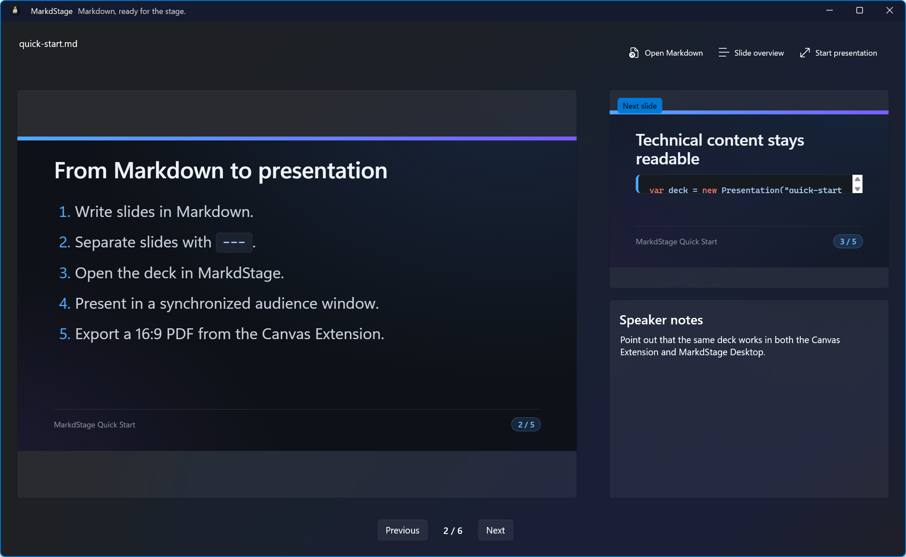
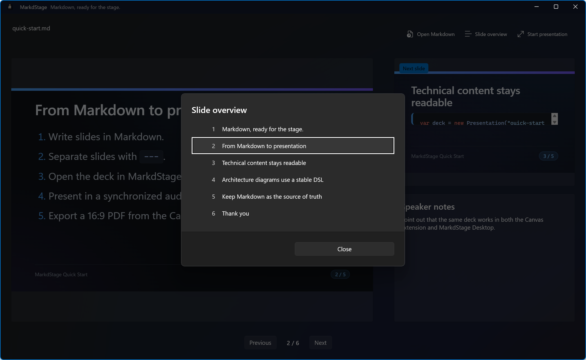
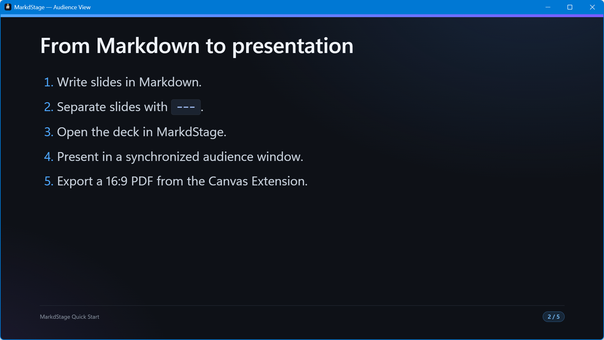

# MarkdStage Desktop

> English version: [English](../desktop.md)

MarkdStage Desktop は Windows 用のスタンドアロン WinUI 3 プレゼンターです。
Canvas Extension と同じレンダラーを使用し、Windows のファイルピッカーから
`.md` と `.markdown` ファイルを開きます。

## インストールして起動する

1. [最新リリース](https://github.com/runceel/markdstage/releases/latest)から
   x64 または ARM64 のポータブル ZIP をダウンロードします。
2. フォルダー全体を展開します。
3. `MarkdStageApp.exe` を実行します。

Microsoft Edge WebView2 Runtime が必要です。ポータブルパッケージには、必要な .NET と
Windows App SDK のコンポーネントが含まれています。

## Markdown ファイルを開く

**Open Markdown** を選択してデッキを開き、プレビューが表示されるまで待ちます。



メインウィンドウには次の要素があります。

- 大きく表示され、操作可能な現在のスライドのプレビュー
- 表示専用の次のスライドのプレビュー
- 現在のスライドのスピーカーノート
- ページカウンター付きの前／次ボタン
- Markdown の読み込み、スライド一覧の表示、オーディエンスウィンドウの開始コマンド

## スライドを移動する

| 入力 | 操作 |
| --- | --- |
| `Left` / `PageUp` | 前のスライド |
| `Right` / `PageDown` / `Space` | 次のスライド |
| `Home` | 最初のスライド |
| `End` | 最後のスライド |
| `O` | スライド一覧を開く |
| 空白部分を左クリックまたはタップ | 次のスライド |
| 空白部分を右クリック | 前のスライド |

空白部分の操作は、現在のスライドのプレビューとオーディエンスウィンドウで使用できます。
スライド内の操作可能なコンテンツは対象外です。

## スライド一覧を開く

**Slide overview** を選択するか `O` を押します。ページ番号とタイトルを選ぶと、
そのスライドへ直接移動できます。



## スピーカーノートを使う

トップレベル HTML コメントにノートを記述します。

```markdown
## Demonstration

- The audience sees this content.

<!--
Explain the setup, then run the demo.
-->
```

Desktop は現在のスライドのノートだけを表示します。オーディエンスウィンドウには表示されません。

## オーディエンスへ表示する

**Start presentation** を選択して、同期されたオーディエンスウィンドウを開きます。



- オーディエンスウィンドウを対象ディスプレイへ移動します。
- `F11` を押して全画面表示にします。
- `Esc` を押してウィンドウ表示へ戻します。
- オーディエンスウィンドウを閉じるか、**End presentation** を選択して終了します。

どちらのウィンドウから移動しても、両方の表示が更新されます。

## 自動再読み込み

Desktop は選択した Markdown ファイルを監視します。有効な保存を検出するとデッキを再読み込みし、
可能な限り現在のスライドを維持します。

無効な保存を検出した場合はエラーを表示し、最後に正常表示されたデッキを維持します。
ファイルを修正して再度保存すると復旧します。

## Surface Pen

オーディエンスウィンドウを開いている間は、次の操作を使用できます。

| ジェスチャー | 操作 |
| --- | --- |
| テールボタンを1回押す | 次のスライド |
| テールボタンを長押しする | 前のスライド |

ペンの接続、取り外し、ドッキングによって MarkdStage が起動したり、
プレゼンテーションが開始されたりすることはありません。

## Desktop の制限

Desktop はプレゼンテーションに特化しています。現在の Desktop アプリでは Markdown の編集、
PDF エクスポート、Architecture 編集、タイマーは使用できません。

[次へ: Markdown の記述 →](markdown-authoring.md)
