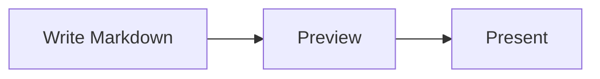

# 図とメディア

> English version: [English](../diagrams-and-media.md)

MarkdStage は Markdown 画像、自動レイアウト用の Mermaid、安定した配置とルーティング用の
Architecture DSL に対応します。

## Mermaid で自動レイアウトする

`mermaid` フェンスを記述します。

````markdown

````

Mermaid は同梱されており、オフラインで動作します。フローチャート、シーケンス図、クラス図、
円グラフなど、自動配置する図に使用します。

Mermaid 構文が無効な場合は、スライドの他のコンテンツを維持したままエラーを表示します。

## Architecture DSL で配置を固定する

要素の位置、寸法、コンテナー、コネクタールートを安定させる必要がある場合は、
`architecture` フェンス内に JSON を記述します。

````markdown
```architecture
{
  "version": 1,
  "canvas": { "width": 1200, "height": 500 },
  "elements": [
    {
      "type": "node",
      "id": "client",
      "x": 80,
      "y": 160,
      "width": 260,
      "height": 140,
      "text": "Client",
      "icon": "browser"
    },
    {
      "type": "node",
      "id": "api",
      "x": 700,
      "y": 160,
      "width": 260,
      "height": 140,
      "text": "API",
      "icon": "api"
    },
    {
      "type": "connector",
      "from": "client",
      "to": "api",
      "routing": "orthogonal",
      "label": "HTTPS"
    }
  ]
}
```
````

ノードは長方形、角丸長方形、楕円に対応します。グループは row、column、grid、layered
レイアウトに対応します。コネクターは straight、orthogonal、polyline ルーティングに対応します。

## Canvas Extension で配置を調整する

**✎** を選択して軽量な配置エディターを開きます。要素を選択し、ドラッグまたは矢印キーで移動します。
エディターには Undo、Redo、レイアウト解除、**Advanced edit** があります。


**📂** で読み込んだ Markdown では、配置の変更がソースの Architecture ブロックへ保存されます。
Canvas で直接作成したデッキでは、変更が Canvas の状態に保存されます。

プレゼンテーション前に編集モードを終了してください。

## Advanced Architecture Editor を使う

配置編集モードから **Advanced edit** を選択して、専用エディターを開きます。


エディターでは次の操作ができます。

- ノード、グループ、画像、コネクターの追加、複製、順序変更、削除
- テキスト、形状、アイコン、位置、サイズ、スタイル、ポート、ルーティング、親グループの変更
- グループレイアウトの適用と解除
- アセットの選択と読み込み
- ドラフト変更の Undo と Redo

変更は **Save** を選択するまでドラフトとして保持されます。Markdown が外部で変更された場合、
エディターは上書きしません。ソースを再読み込みし、必要な変更を適用し直してください。

Advanced editing には、**📂** で読み込んだソース関連付け済みデッキと、既存の
`architecture` ブロックが必要です。空のブロックも有効で、エディターから要素を追加できます。

````markdown
```architecture
```
````

## 画像を追加する

標準 Markdown 画像では `/assets/...` を使用します。

```markdown

```

Architecture のアイコンと単独画像では、先頭のスラッシュを付けません。

```json
{
  "type": "image",
  "id": "map",
  "src": "assets/map.svg",
  "fit": "contain",
  "ariaLabel": "Regional system map",
  "x": 80,
  "y": 80,
  "width": 720,
  "height": 420
}
```

Architecture の画像調整には `contain`、`cover`、`stretch` を使用できます。
ローカルファイルは SVG、PNG、WebP、JPEG、JPG に対応します。

[次へ: プレゼンテーションとエクスポート →](presenting-and-export.md)
