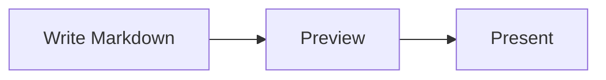

# 図とメディア

> English version: [English](../diagrams-and-media.md)

MarkdStage では、Markdown の画像、自動でレイアウトされる Mermaid、位置や経路を固定できる
Architecture DSL を使えます。

## Mermaid で自動レイアウトする

`mermaid` フェンスに図を書きます。

````markdown

````

Mermaid は同梱しているのでオフラインでも動きます。フローチャート、シーケンス図、クラス図、
円グラフなど、配置を自動で決めてよい図に向いています。

Mermaid の構文に誤りがある場合は、スライドの他の内容はそのままにエラーを表示します。

## Architecture DSL で配置を固定する

要素の位置、大きさ、コンテナー、コネクターの経路を思いどおりに固定したいときは、
`architecture` フェンスに JSON を書きます。

````markdown
```architecture
{
  "version": 1,
  "canvas": { "width": 1200, "height": 500 },
  "elements": [
    {
      "type": "node",
      "id": "client",
      "x": 80,
      "y": 160,
      "width": 260,
      "height": 140,
      "text": "Client",
      "icon": "browser"
    },
    {
      "type": "node",
      "id": "api",
      "x": 700,
      "y": 160,
      "width": 260,
      "height": 140,
      "text": "API",
      "icon": "api"
    },
    {
      "type": "connector",
      "from": "client",
      "to": "api",
      "routing": "orthogonal",
      "label": "HTTPS"
    }
  ]
}
```
````

ノードには長方形、角丸長方形、楕円、ひし形、三角形、六角形、平行四辺形を使えます。
追加された形状も Architecture DSL v1 のまま下位互換で、PowerPoint ではネイティブ図形として
書き出されます。グループには row、column、grid、layered のレイアウトがあり、コネクターは
straight、orthogonal、polyline の経路を選べます。

コネクターの線種は既存の `style.dash` を使います。実線は `dash` を省略し、点線は
`"dash": "1 5"`、破線は `"10 6"` のような数値パターンを指定します。

## Canvas Extension で配置を調整する

Markdown の元ファイルにひも付かない Canvas で直接作ったデッキでは、
**More controls > Shape editing** を選ぶと、手早く使える配置エディターが開きます。
要素を選び、ドラッグか矢印キーで動かします。エディターには Undo、Redo、レイアウト解除があります。


Canvas で直接作ったデッキでは、変更は Canvas 側に保存されます。

発表を始める前に、編集モードを終了してください。

## Advanced Architecture Editor を使う

**More controls > Open Markdown** で読み込んだ Markdown では、
**More controls > Shape editing** から専用エディターへ直接移動します。現在のスライドに
Architecture ブロックが複数ある場合は、先にピッカーから編集対象を選びます。


エディターでは次の操作ができます。

- ノード、グループ、画像、コネクターの追加、複製、並べ替え、削除
- テキスト、形状、アイコン、位置、サイズ、スタイル、ポート、経路、親グループの変更
- グループレイアウトの適用と解除
- 画像ファイルの選択と読み込み
- キャンバスの余白ドラッグによる上下左右のパン
- Elements / Properties の折りたたみ。中幅では非モーダルドック、狭幅では
  キャンバスを遮断しないオーバーレイとして表示
- 補助コマンドを **More** にまとめ、キャンバスを主役として維持
- 空の図を **Add first shape** から開始
- 編集中の内容の Undo と Redo

変更は **Save** を選ぶまで下書きのままです。Markdown が外部で書き換えられていた場合、
エディターはそれを上書きしません。元のファイルを読み込み直してから、変更をやり直してください。

Advanced editing を使うには、**More controls > Open Markdown** で読み込んだ元ファイルと
ひも付くデッキと、`architecture` ブロックが必要です。次のように中身が空でも構いません。
エディターから要素を足せます。

````markdown
```architecture
```
````

## 画像を追加する

通常の Markdown 画像では `/assets/...` と書きます。

```markdown

```

Architecture のアイコンと単独画像では、先頭のスラッシュを付けません。

```json
{
  "type": "image",
  "id": "map",
  "src": "assets/map.svg",
  "fit": "contain",
  "ariaLabel": "Regional system map",
  "x": 80,
  "y": 80,
  "width": 720,
  "height": 420
}
```

Architecture の画像の収め方は `contain`、`cover`、`stretch` から選べます。
ローカルファイルは SVG、PNG、WebP、JPEG、JPG を扱えます。

[次へ: プレゼンテーションとエクスポート →](presenting-and-export.md)
