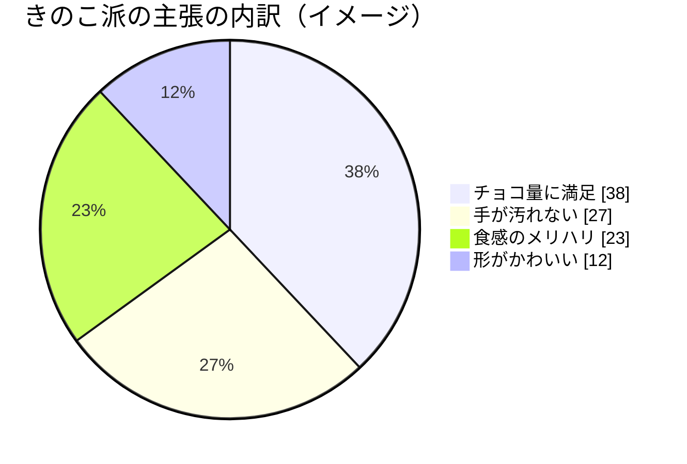

# きのこ vs たけのこ 戦争に終止符を

～ なぜ「きのこの山」が優れているのか ～

---

## 本日のアジェンダ

1. きのたけ戦争とは何か
2. きのこ派の三大主張
3. データで見るきのこの優位性
4. たけのこ派への反論
5. 結論：きのこの勝利

> ※ 本スライドは presentation スキルのサンプルです。内容は親しみやすさ重視のネタです 🍄

---

## きのたけ戦争とは

- 「**きのこの山**」と「**たけのこの里**」、どちらが上かを巡る論争
- 発売は **きのこの山が先輩**（1975 年〜）
- SNS やネットで定期的に再燃する国民的話題
- 本日は**きのこ派**の立場から、その優位性を論証します

---

## きのこ派・三大主張

| 観点 | きのこの山 | たけのこの里 |
| --- | --- | --- |
| チョコの量 | **多い**（傘がたっぷり） | 少なめ |
| 手の汚れにくさ | **軸を持てる** | 持つ所が曖昧 |
| 食感のメリハリ | クラッカー＋チョコで**明確** | クッキー一体型 |

→ いずれも**きのこに軍配**が上がります。

---

## 主張①：チョコとビスケットが「別役」

- きのこは **傘＝チョコ**、**軸＝クラッカー** と役割が明確
- ひと口で「**パリッ**」と「**とろり**」の二重奏 🎵
- 食感のコントラストが満足感を生む
- たけのこは一体型ゆえ、味の変化が単調になりがち

---

## 主張②：持ち手があるから汚れない

- きのこは**軸**という天然の「持ち手」を装備
- 指にチョコが付きにくく、**作業しながら食べられる**
- デスクでもアウトドアでも安心
- たけのこは持つ場所が曖昧で、指チョコ事故が起きやすい

---

## データで見る支持の広がり

- 「**チョコ量**」と「**手の汚れにくさ**」が支持の二本柱
- ※ 数値は説明用のイメージです

---

## たけのこ派への反論

- **「たけのこの方がチョコ濃厚」** 🤔
  - → きのこは**面積**で勝負。総チョコ体験はむしろ上
- **「クッキーが美味しい」**
  - → きのこの**クラッカーの塩気**がチョコを引き立てる
- **「形が安定して持ちやすい」**
  - → 安定性なら**軸でつまむ**きのこも負けていない

---

# 結論：きのこの勝利 🍄

- **チョコ × クラッカー**の二重奏で食感に勝る
- **軸という持ち手**で手が汚れない実用性
- 役割の明確さが、満足度の高さに直結

> よって、きのこの山に軍配。たけのこの里も愛すべき好敵手です 🤝

---

# ご清聴 ありがとうございました

きのこ派・たけのこ派、どちらも語り合えるのが一番のお菓子です 🍫
