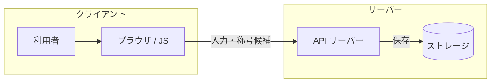
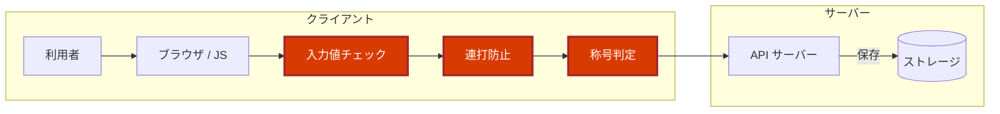
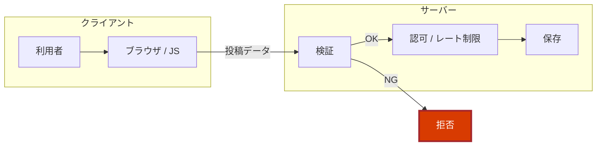

# なんコパ2周年🎉<br>祝電アプリの裏側

～ AI でサクッと作ったアプリを、開発者の目で覗いてみた ～

なんでもCopilot #83 ／ Kazuki Ota（@okazuki）

---

## 自己紹介

- 大田 一希 (Kazuki Ota)
- Microsoft ／ Cloud Solution Architect & Evangelist
- 好きなもの: **C#** ／ **.NET** ／ **GitHub Copilot**
- X: **@okazuki**
- zenn: https://zenn.dev/okazuki

---

## 今日のはなし 🎯

- お祝いアプリは **AI コーディングでサクッと完成**
- 1 年前は何日もかけたのに凄い進化
- **開発者目線で見て何か問題があるかな？**

---

## 主役：2周年祝電アプリ 🎂

- なんコパ 2 周年の **お祝いメッセージボード**
- メッセージを投稿 → **コルクボードにふわふわ表示**
- 投稿数に応じて **称号バッジ**（無印 → 🌟 なんコパビギナー → …）
- 紙吹雪・パーティクル・X シェアまで完備 🎊

https://gray-hill-0599a9a00.7.azurestaticapps.net/

---

## AI でサクッと作成 🤖

- **Azure Static Web Apps** + **Azure Functions API**
- フロントは **Vanilla JS**（GSAP / canvas-confetti / html2canvas）
- API は投稿（`PostComment`）と一覧取得（`GetComments`）だけのシンプル構成
- 見た目もアニメも完成度が高い。**普通に良いアプリ** 👏

> 「動くもの」が一瞬でできる。これは本当にすごいこと。

---

## 処理の流れ 🧐



- **クライアント** は、利用者が直接触る場所
- **サーバー** は、検証して保存する場所

---

## 危険なポイント

- **入力値チェック・連打防止・称号判定** がクライアント側にある
- → **開発者ツールから素通り** できてしまう
- 本来は **サーバー側で検証** すべき



---

## 穴① 投稿数を一気に増やせる 🚀

- 連打防止は **JS の 3 秒クールダウンだけ**（`SUBMIT_COOLDOWN: 3000`）
- ログイン不要・サーバー側のレート制限なし
- → コンソールから **API を直接連打** すれば投稿数が一気に増やせる (これは、やると危ないのでやらない！)

- 称号カウントも **`localStorage` 頼み**
  - 開発者ツール → **Application → Local Storage** で `nancopa_post_count` を書き換えるだけ
  - → 次の投稿で一発 👑 **なんコパマスター** 確定

> 🎬 デモ

---

## 穴② 称号に好きな文字列 🏷️

- 称号バッジは **ブラウザが計算 → そのまま送信**
- サーバーは投稿数を検証せず、受け取った文字列を **保存＆表示**
- → 開発者ツール **Network タブ** でリクエストを書き換えれば好きな称号を名乗れる

> 🎬 デモ

---

## 問題の原因：クライアントを信じすぎ 🫠

- **検証・認可・レート制限・称号判定** が、ぜんぶ **ブラウザ側** で実装
- でもブラウザは **利用者が自由に操作できる場所**
- → **サーバー側での検証が必要**

---

## クライアントサイドの対処はバッチリ 👍

```js
// comments.js: 表示はちゃんとエスケープ済み
function escapeHtml(str) {
  const div = document.createElement('div');
  div.textContent = str;   // XSS は防げている
  return div.innerHTML;
}
```

- **XSS 対策（HTML エスケープ）はバッチリ**
- AI は「**定番の対策**」はちゃんとやってくれる
- 抜けやすいのは「**サーバー側でちゃんと確認する**」という発想と「**業務ロジックの検証**」

---

## 対処方法 🛠️



- **サーバー側で確認**：検証・認可・レート制限
- 称号は **サーバーが投稿数を数えて** 判定（クライアントを信じない）
  - 今回のようなアプリならクライアント側でやるという割り切りも有り
- 「クライアントから来る値は **すべて疑う**」が基本
- **AI 生成物は“レビュー前提”**。動く ≠ 安全

---

## まとめ 🎉

- AI で **「動くもの」は一瞬** で作れる、最高の時代
- **「動く」と「ちゃんと動く」は別物**
- 今回抜けていたもの **サーバー側の検証処理**
- AI で作ったものは人間で確認するか、そうならないように skill あどで指示をしておく

---

# ありがとう<br/>ございました 🙌

なんコパ 3 年目突入おめでとうございます🎉

Kazuki Ota ／ X: **@okazuki** ／ zenn: https://zenn.dev/okazuki
