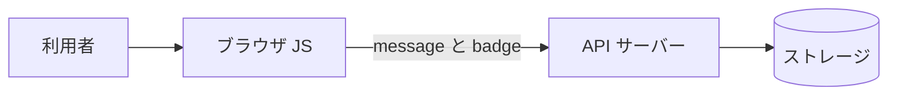

# なんコパ2周年🎉<br>祝電アプリの裏側

～ AI でサクッと作ったアプリを、開発者の目で覗いてみた ～

なんでもCopilot #83 ／ Kazuki Ota（@okazuki）

---

## 自己紹介

- 大田 一希 (Kazuki Ota)
- Microsoft ／ Cloud Solution Architect & Evangelist
- 好きなもの: **C#** ／ **.NET** ／ **GitHub Copilot**
- X: **@okazuki**
- zenn: https://zenn.dev/okazuki

---

## 今日のはなし 🎯

- お祝いアプリは **AI コーディングでサクッと完成**。すごい時代！
- でも…**開発者の目で見ると、ちょっと穴がある**
- 「サクッと作ったもの」には **いたずらの余地** が残りがち

> ※ 中傷ではなく「AI 時代の学び」として。実際にアプリを荒らすのはナシでお願いします🙏

---

## 主役：2周年祝電アプリ 🎂

- なんコパ 2 周年の **お祝いメッセージボード**
- メッセージを投稿 → **コルクボードにふわふわ表示**
- 投稿数に応じて **称号バッジ**（🌟 なんコパビギナー → 👑 なんコパマスター）
- 紙吹雪・パーティクル・X シェアまで完備 🎊

https://gray-hill-0599a9a00.7.azurestaticapps.net/

---

## これ、AI でサクッとできました 🤖

- **Azure Static Web Apps** + **Azure Functions API**
- フロントは **Vanilla JS**（GSAP / canvas-confetti / html2canvas）
- API は投稿（`PostComment`）と一覧取得（`GetComments`）だけのシンプル構成
- 見た目もアニメも完成度が高い。**普通に良いアプリ** 👏

> 「動くもの」が一瞬でできる。これは本当にすごいこと。

---

## でも、開発者の目で見ると…？ 🧐



- 称号の判定も、連打防止も、**ぜんぶブラウザ側**
- サーバーは送られてきた値を **そのまま保存**
- → **開発者ツールから素通り** できてしまう

---

## 穴① 投稿数を一気に増やせる 🚀

- 連打防止は **JS の 3 秒クールダウンだけ**（`SUBMIT_COOLDOWN: 3000`）
- ログイン不要・サーバー側のレート制限なし
- → コンソールから **API を直接連打** すれば投稿数が一気に増やせる

- 称号カウントも **`localStorage` 頼み**
  - 開発者ツール → **Application → Local Storage** で `nancopa_post_count` を書き換えるだけ
  - → 次の投稿で一発 👑 **なんコパマスター** 確定

> 🎬 デモ

---

## 穴② 称号に好きな文字列 🏷️

- 称号バッジは **ブラウザが計算 → そのまま送信**
- サーバーは投稿数を検証せず、受け取った文字列を **保存＆表示**
- → 開発者ツール **Network タブ** でリクエストを書き換えれば好きな称号を名乗れる

> 🎬 デモ

---

## 共通の根っこ：クライアントを信じすぎ 🫠

- **検証・認可・レート制限・称号判定** が、ぜんぶ **ブラウザ側**
- でもブラウザは **利用者が自由に操作できる場所**
- 「画面の都合」と「守りのロジック」が **同じ場所** にある
- → **サーバーを“信頼の境界（最後の砦）”にしていない**

---

## 意外と、できてる所もある 👍

```js
// comments.js: 表示はちゃんとエスケープ済み
function escapeHtml(str) {
  const div = document.createElement('div');
  div.textContent = str;   // XSS は防げている
  return div.innerHTML;
}
```

- **XSS 対策（HTML エスケープ）はバッチリ**
- AI は「**定番の対策**」はちゃんとやってくれる
- 抜けやすいのは「**サーバー側でちゃんと確認する**」という発想と「**業務ロジックの検証**」

---

## じゃあ、どうする？ 🛠️

- **守りはサーバー側に置く**：検証・認可・レート制限
- 称号は **サーバーが投稿数を数えて** 判定（クライアントを信じない）
- 「クライアントから来る値は **すべて疑う**」が基本
- **AI 生成物は“レビュー前提”**。動く ≠ 安全

---

## まとめ 🎉

- AI で **「動くもの」は一瞬** で作れる、最高の時代
- でも **「動く」と「守られている」は別物**
- 抜けやすいのは **「サーバー側で確認する」という発想・認可・入力値の検証**
- AI は最強の相棒、**最後の砦は人間（とサーバー）**

> 穴も含めて、2 周年おめでとうございます！🎂🎊

---

# ありがとう<br>ございました 🙌

なんコパ 2 周年、おめでとうございました！🎉

Kazuki Ota ／ X: **@okazuki** ／ zenn: https://zenn.dev/okazuki
