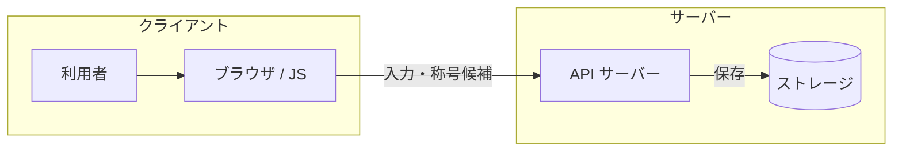
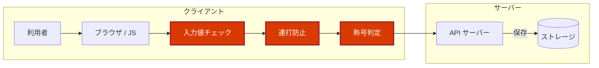
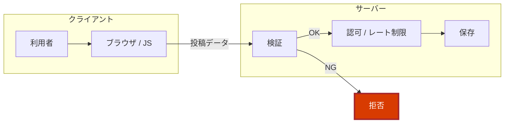

# なんコパ2周年🎉 祝電アプリの裏側

～ 祝電アプリを、開発者の目で覗いてみた ～

なんでもCopilot #83 ／ Kazuki Ota（@okazuki）

---

## 自己紹介

- 大田 一希 (Kazuki Ota)
- Microsoft ／ Cloud Solution Architect & Evangelist
- 好きなもの: **C#** ／ **.NET** ／ **GitHub Copilot**
- X: **@okazuki**
- zenn: https://zenn.dev/okazuki

---

## 今日のはなし 🎯

- AI コーディングでサクッと完成した祝電アプリ
- 今年はサクッとできたので記憶に残ってないレベル
    - 1 年前は何日もかけたのに凄い進化
- アプリを開発者目線で裏側を除いてみる

---

## 主役：2周年祝電アプリ 🎂

- なんコパ 2 周年の **お祝いメッセージボード**
- メッセージを投稿 → **コルクボードにふわふわ表示**
- 投稿数に応じて **称号バッジ**（無印 → 🌟 なんコパビギナー → …）
- 紙吹雪・パーティクル・X シェアまで完備 🎊

https://gray-hill-0599a9a00.7.azurestaticapps.net/

---

## AI でサクッと作成 🤖

- **Azure Static Web Apps** + **Azure Functions** + **Cosmos DB**
- フロントは **Vanilla JS**（GSAP / canvas-confetti / html2canvas）
- 見た目もアニメも完成度が高い。**普通に良いアプリ** 👏

---

## 処理の流れ 🧐

- **クライアント** は、利用者が直接触る場所 (ブラウザ)
- **サーバー** は、クライアントからのリクエストを処理してデータを保存する場所

---

## 危険なポイント

- **入力値チェック・連打防止・称号判定** がクライアント側にある
- → **画面意外から API を直接叩くとやりたい放題**

---

## 問題点① 投稿数を一気に増やせる 🚀

- 連打防止は **JS の 3 秒クールダウンだけ**（`SUBMIT_COOLDOWN: 3000`）
- ログイン不要・サーバー側のレート制限なし
- → コンソールから **API を直接連打** すれば投稿数が一気に増やせる (これは、やると危ないのでやらない！)
- 投稿数カウントもブラウザに保存されている
    - 開発者ツールで書き換え可能
    - → 次の投稿で一発最高の称号ゲット！

> 🎬 デモ

---

## 問題点② 称号に好きな文字列 🏷️

- 称号バッジは **ブラウザが作成 → そのまま送信**
- サーバーは投稿数を検証せず、受け取った文字列を **保存＆表示**
- → 開発者ツール **Network タブ** でリクエストを書き換えれば好きな称号を名乗れる

> 🎬 デモ

---

## 犯行の例

---

## 問題の原因：クライアントを信じすぎ 🫠

- **検証・認可・レート制限・称号判定** が、ぜんぶ **ブラウザ側** で実装
- → **サーバー側での検証が必要**

---

## 対処方法 🛠️

- **サーバー側で確認**：検証・認可・レート制限
- 称号は **サーバーが投稿数を数えて** 判定（クライアントを信じない）
    - 今回のようなアプリならクライアント側でやるという割り切りも有り
- 「クライアントから来る値は **すべて疑う**」が基本

---

## まとめ 🎉

- AI で「動くもの」は一瞬で作れる、最高の時代
- 今回抜けていたものサーバー側の検証処理
- 全体を通して問題がないかどうかは見逃しがち
    - AI で作ったものは人間で確認するか、そうならないように skill などで指示をしておく

---

# ありがとう ございました 🙌

～ 祝電アプリを、開発者の目で覗いてみた ～

なんコパ 3 年目突入おめでとうございます🎉

Kazuki Ota ／ X: **@okazuki** ／ zenn: https://zenn.dev/okazuki