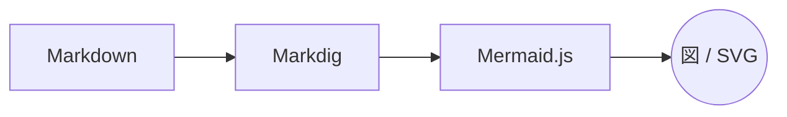

# Copilot canvas で<br>プレゼンしよう

GitHub Copilot とつくる、ライブなスライド発表

---

## このプレゼンの仕組み

- スライドは **Markdown**（このファイル）に書く
- Copilot は 1 枚ずつ **小さな Markdown 断片**を生成するだけ
- **HTML 変換・装飾は .NET 10 / Blazor アプリ**が担当
- ファイルを上書きすると **自動でスライドが切り替わる** ⚡

---

## ページ送りは ask_user で

- **次へ ▶** / **◀ 前へ** で 1 枚ずつ移動
- **スライド一覧 ☰** から任意のスライドへジャンプ
- **再読み込み ↻** で表示を作り直し
- **終了 ✖** で発表を終える

> 発表者は選択肢を選ぶだけ。スライドは Copilot が生成します。

---

## コードもきれいに表示

```csharp
app.MapGet("/slide", (SlideState s, HttpContext ctx) =>
{
    ctx.Response.Headers.CacheControl = "no-store";
    return Results.Content(s.ReadCurrentHtml(), "text/html");
});
```

`current.md` を上書きするだけでスライドが入れ替わります。

---

## はじめかた

1. このリポジトリで Copilot にこう伝える:
   - 「**slides.md に従ってプレゼンしてください**」
2. ブラウザー canvas にスライドが表示される
3. あとは選択肢でページを送るだけ 🎉

---

## 図も画像も使える




- 図は **Mermaid 記法**（` ```mermaid ` ブロック）でそのまま描ける
- 画像は **リモート URL** か、`assets/` に置いた**ローカルファイル**で挿入

---

# ありがとうございました

質問やフィードバックをどうぞ！
