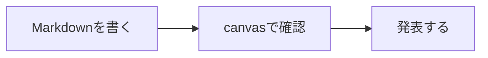

# presentation canvas
## Markdown でスライドを作る

このファイルを読みながら、canvas の操作とスライドの書き方を紹介します。

---

## まずは canvas を操作する

- **▶ / ◀**: 次のスライド、前のスライドへ移動
- **矢印キー**: `→` で次へ、`←` で前へ
- **☰**: スライド一覧を開いて、見たいページへジャンプ
- **⛶**: 1280x720 の外部ウィンドウでプレゼンを開始（Windows では `F11` で全画面化）
- **印刷アイコン**: デッキを 16:9 の PDF として保存

ページ送りは canvas 側で行われます。チャットから「3枚目へ」と指定することもできます。

---

## スライドは `---` で区切る

1つの Markdown ファイルに、複数のスライドを書けます。

スライドの終わりに、行頭から `---` だけを書きます。

```markdown
# 1枚目のタイトル

最初のスライドです。

---

## 2枚目の見出し

- ここから次のスライド
```

コードブロック内の `---` は、スライドの区切りとして扱われません。

---

## front matter で見た目を整える

スライドの先頭に、`---` で囲んだ設定を書けます。

```markdown
---
deck: はじめてのプレゼン
kicker: Getting started
page: 2
total: 6
---
## スライドの見出し

- ページ番号がフッターに表示されます
```

- `deck`: フッターに表示するデッキ名
- `kicker`: 見出しの上に表示するラベル
- `page` / `total`: ページ番号と総ページ数
- 先頭スライドに `layout: title` を付けると表紙になります

---

## Markdown をそのまま活用する

見出し、箇条書き、強調、リンク、表を組み合わせます。

| 記法 | 用途 |
| --- | --- |
| `## 見出し` | スライドの主題 |
| `- 項目` | 要点の整理 |
| `**太字**` | 重要語の強調 |
| `` `code` `` | コードや設定値 |

文章を詰め込みすぎず、1枚につき1つの主題にすると読みやすくなります。

---

## コードや図も表示できる

コードブロックには言語名を付けると、シンタックスハイライトされます。

```javascript
const slides = ["learn", "write", "present"];
console.log(slides);
```

Mermaid のコードブロックは、図としてレンダリングされます。


```mermaid
flowchart LR
    A[Markdownを書く] --> B[canvasで確認]
    B --> C[発表する]
```

---

## v1.1.0: Architecture DSL の図

`architecture` コードフェンスに JSON を書くと、配置を固定した構成図を表示できます。

- レイアウト: `row` / `column` / `grid` / `layered`
- 図形とスタイル: `rect` / `rounded-rect` / `ellipse`
- 経路: `straight` / `orthogonal` / `polyline`

---

## レイアウト駆動の構成図

子要素の座標を個別に書かず、group のレイアウトで整列します。

```architecture
{
  "version": 1,
  "title": "Layout-driven platform",
  "description": "A client, service and data flow arranged with nested layouts.",
  "canvas": { "width": 1600, "height": 900 },
  "elements": [
    {
      "type": "group",
      "id": "layout-clients",
      "title": "Clients",
      "x": 60,
      "y": 240,
      "width": 360,
      "height": 360,
      "layout": { "type": "column", "gap": 42, "padding": 54 },
      "children": [
        { "type": "node", "id": "layout-browser", "text": "Browser", "icon": "browser" },
        { "type": "node", "id": "layout-mobile", "text": "Mobile", "icon": "mobile" }
      ]
    },
    {
      "type": "group",
      "id": "layout-services",
      "title": "Services",
      "x": 520,
      "y": 160,
      "width": 620,
      "height": 520,
      "layout": { "type": "grid", "columns": 2, "columnGap": 70, "rowGap": 46, "padding": 54 },
      "children": [
        { "type": "node", "id": "layout-api", "text": "API", "icon": "api" },
        { "type": "node", "id": "layout-worker", "text": "Worker", "icon": "server" },
        { "type": "node", "id": "layout-queue", "text": "Queue", "icon": "queue" },
        { "type": "node", "id": "layout-cache", "text": "Cache", "icon": "database" }
      ]
    },
    {
      "type": "node",
      "id": "layout-data",
      "x": 1270,
      "y": 330,
      "width": 260,
      "height": 140,
      "text": "Database",
      "icon": "database",
      "shape": "ellipse"
    },
    { "type": "connector", "from": "layout-browser", "to": "layout-api", "routing": "orthogonal" },
    { "type": "connector", "from": "layout-mobile", "to": "layout-api", "routing": "orthogonal", "lane": 1 },
    { "type": "connector", "from": "layout-api", "to": "layout-data", "routing": "orthogonal", "label": "query" },
    { "type": "connector", "from": "layout-worker", "to": "layout-data", "routing": "straight" }
  ]
}
```

---

## 図形・スタイル・経路

図形の種類、style、connector の routing を1枚で確認できます。

```architecture
{
  "version": 1,
  "title": "Shape and routing coverage",
  "description": "Three shapes, styled nodes and three connector routing modes.",
  "canvas": { "width": 1600, "height": 900 },
  "elements": [
    {
      "type": "node",
      "id": "shape-rect",
      "x": 90,
      "y": 170,
      "width": 300,
      "height": 140,
      "text": "Rect",
      "shape": "rect",
      "style": { "fill": "surface", "stroke": "accent", "strokeWidth": 3 }
    },
    {
      "type": "node",
      "id": "shape-rounded",
      "x": 90,
      "y": 380,
      "width": 300,
      "height": 140,
      "text": "Rounded",
      "shape": "rounded-rect",
      "style": { "fill": "accentSoft", "stroke": "accentStrong", "cornerRadius": 28 }
    },
    {
      "type": "node",
      "id": "shape-ellipse",
      "x": 90,
      "y": 590,
      "width": 300,
      "height": 140,
      "text": "Ellipse",
      "shape": "ellipse",
      "style": { "fill": "bg", "stroke": "accentLine", "dash": "10 6" }
    },
    {
      "type": "node",
      "id": "shape-target",
      "x": 1120,
      "y": 380,
      "width": 320,
      "height": 160,
      "text": "Target",
      "icon": "cloud",
      "style": { "fill": "surface", "stroke": "accent" }
    },
    { "type": "connector", "from": "shape-rect", "to": "shape-target", "routing": "straight", "label": "straight" },
    { "type": "connector", "from": "shape-rounded", "to": "shape-target", "routing": "orthogonal", "label": "orthogonal" },
    {
      "type": "connector",
      "from": "shape-ellipse",
      "to": "shape-target",
      "routing": "polyline",
      "points": [{ "x": 720, "y": 660 }, { "x": 900, "y": 660 }],
      "label": "polyline"
    }
  ]
}
```

---

## 密な構成図の自動ルーティング

依存関係だけを宣言し、複数の経路が交差する図も自動配線できます。

```architecture
{
  "version": 1,
  "title": "Dense service routing",
  "description": "A compact service graph with orthogonal connectors and no manual polylines.",
  "canvas": { "width": 1600, "height": 900 },
  "elements": [
    { "type": "node", "id": "dense-web", "x": 80, "y": 140, "width": 240, "height": 100, "text": "Web", "icon": "browser" },
    { "type": "node", "id": "dense-mobile", "x": 80, "y": 400, "width": 240, "height": 100, "text": "Mobile", "icon": "mobile" },
    { "type": "node", "id": "dense-gateway", "x": 470, "y": 270, "width": 250, "height": 100, "text": "Gateway", "icon": "api" },
    { "type": "node", "id": "dense-orders", "x": 870, "y": 140, "width": 250, "height": 100, "text": "Orders", "icon": "server" },
    { "type": "node", "id": "dense-search", "x": 870, "y": 400, "width": 250, "height": 100, "text": "Search", "icon": "analytics" },
    { "type": "node", "id": "dense-store", "x": 1270, "y": 270, "width": 240, "height": 100, "text": "Data store", "icon": "database" },
    { "type": "connector", "from": "dense-web", "to": "dense-gateway", "routing": "orthogonal" },
    { "type": "connector", "from": "dense-mobile", "to": "dense-gateway", "routing": "orthogonal", "lane": 1 },
    { "type": "connector", "from": "dense-gateway", "to": "dense-orders", "routing": "orthogonal" },
    { "type": "connector", "from": "dense-gateway", "to": "dense-search", "routing": "orthogonal", "label": "query" },
    { "type": "connector", "from": "dense-orders", "to": "dense-store", "routing": "orthogonal" },
    { "type": "connector", "from": "dense-search", "to": "dense-store", "routing": "orthogonal" },
    { "type": "connector", "from": "dense-web", "to": "dense-search", "routing": "orthogonal", "label": "direct" }
  ]
}
```

---

## カスタム画像を Architecture DSL に組み込む

standalone image と node icon は、同じ `assets/` の画像を参照できます。

```architecture
{
  "version": 1,
  "title": "Custom image example",
  "description": "A standalone custom image connected to a node that uses the same asset as its icon.",
  "canvas": { "width": 1600, "height": 900 },
  "elements": [
    {
      "type": "image",
      "id": "image-sample",
      "src": "assets/architecture-image-sample.svg",
      "fit": "contain",
      "ariaLabel": "Architecture DSL のカスタム画像サンプル",
      "x": 80,
      "y": 160,
      "width": 900,
      "height": 560,
      "style": { "fill": "surface", "stroke": "accent", "strokeWidth": 4, "cornerRadius": 28 }
    },
    {
      "type": "node",
      "id": "image-node",
      "text": "Custom image",
      "icon": "assets/architecture-image-sample.svg",
      "x": 1180,
      "y": 340,
      "width": 300,
      "height": 160,
      "style": { "fill": "surface", "stroke": "accentStrong", "strokeWidth": 3 }
    },
    {
      "type": "connector",
      "from": "image-sample",
      "to": "image-node",
      "routing": "orthogonal",
      "label": "same asset",
      "arrow": true
    }
  ]
}
```

---

## 画像とリンクを追加する

画像は `assets/` フォルダーに置き、絶対パスで参照します。


外部ページへのリンクも Markdown の記法で書けます。

```markdown
[presentation canvas のリポジトリ](https://github.com/runceel/github-copilot-app-presentation)
```

画像には、表示できないときにも意味が伝わる説明文を付けます。

---

## テーマとサイズを選ぶ

デッキ全体のテーマは、canvas を開くときに指定します。

- `dark`: 落ち着いたダークテーマ（既定）
- `light`: 明るく中立的なテーマ
- `microsoft`: Fluent 配色
- `custom`: CSS カスタムプロパティで独自の配色や表紙を定義

カスタムテーマは、Markdown からテーマファイルを指定します。

```markdown
---
theme: custom
theme-file: ./themes/brand/theme.css
---
```

---

## スライドのサイズを調整する

特に強調したいページには、本文の先頭へ指定を追加できます。

```markdown
<!-- slide-size: large -->

## 大きく見せたいスライド
```

---

## 最小構成で始める

```markdown
# 私のプレゼン

---

## 今日伝えたいこと

- 要点を1つ
- 要点を2つ
- 最後に次のアクション
```

**書く → canvas で確認する → ページを送って発表する**。これだけで始められます。

---

## まとめ

- Markdown のファイルを `---` でスライドに分ける
- front matter でデッキ名、ラベル、ページ番号を設定する
- 箇条書き、コード、表、Mermaid、画像を組み合わせる
- canvas のボタンやキーボードで発表する
- 印刷アイコンから、プレゼン全体を PDF に書き出せる

まずはこのファイルをコピーして、自分のタイトルと要点に置き換えてみましょう。
