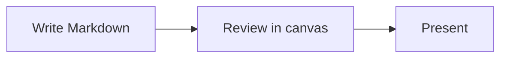

# MarkdStage
## Markdown, ready for the stage.

This deck introduces canvas controls and slide authoring.

<!--
**Speaker notes 1 / 16**

Use this title slide to explain that Markdown supports the entire workflow from authoring to presenting.
-->

---

## Start with the canvas controls

- **▶ / ◀**: Move to the next or previous slide
- **Arrow keys**: Press `→` for next or `←` for previous
- **☰**: Open the slide list and jump to any slide
- **⛶**: Start presenting in a 1280x720 external window (press `F11` for full screen on Windows)
- **16:9**: Preview the fixed PDF layout and warn about clipped content
- **Print icon**: Save the deck as a 16:9 PDF

Navigation happens in the canvas. You can also request "Go to slide 3" in chat.

<!--
**Speaker notes 2 / 16**

Try both the bottom control bar and keyboard navigation.
-->

---

## Separate slides with `---`

One Markdown file can contain multiple slides.

At the end of a slide, add a line containing only `---`.

```markdown
# First slide title

This is the first slide.

---

## Second slide heading

- The next slide starts here
```

The `---` inside a code block is not treated as a slide separator.

<!--
**Speaker notes 3 / 16**

Emphasize that the separator in the code example does not create another slide.
-->

---

## Configure appearance with front matter

At the start of a slide, place settings between `---` lines.

```markdown
---
deck: First presentation
kicker: Getting started
page: 2
total: 6
---
## Slide heading

- The page number appears in the footer
```

- `deck`: Deck name shown in the footer
- `kicker`: Label shown above the heading
- `page` / `total`: Current page number and total page count
- Add `layout: title` to the first slide to make it a title slide

<!--
**Speaker notes 4 / 16**

Front matter controls only appearance and metadata; the body remains standard Markdown.
-->

---

## Use Markdown directly

Combine headings, lists, emphasis, links, and tables.

| Syntax | Purpose |
| --- | --- |
| `## Heading` | Slide topic |
| `- Item` | Organize key points |
| `**Bold**` | Emphasize important terms |
| `` `code` `` | Code or configuration values |

Keep slides readable by avoiding dense prose and presenting one topic per slide.

<!--
**Speaker notes 5 / 16**

Confirm that tables, emphasis, and inline code use consistent theme styling.
-->

---

## Display code and diagrams

Add a language name to a code block to enable syntax highlighting.

```javascript
const slides = ["learn", "write", "present"];
console.log(slides);
```

Mermaid code blocks render as diagrams.


```mermaid
flowchart LR
    A[Write Markdown] --> B[Review in canvas]
    B --> C[Present]
```

<!--
**Speaker notes 6 / 16**

Demonstrate code syntax highlighting, then Mermaid rendering.
-->

---

## v1.1.0: Architecture DSL diagrams

Write JSON in an `architecture` code fence to render a diagram with fixed placement.

- Layouts: `row` / `column` / `grid` / `layered`
- Shapes and styles: `rect` / `rounded-rect` / `ellipse`
- Routes: `straight` / `orthogonal` / `polyline`

<!--
**Speaker notes 7 / 16**

Introduce the Architecture DSL examples that follow.
-->

---

## Layout-driven architecture diagram

Align child elements with a group layout instead of assigning each child explicit coordinates.

```architecture
{
  "version": 1,
  "title": "Layout-driven platform",
  "description": "A client, service and data flow arranged with nested layouts.",
  "canvas": { "width": 1600, "height": 900 },
  "elements": [
    {
      "type": "group",
      "id": "layout-clients",
      "title": "Clients",
      "x": 60,
      "y": 240,
      "width": 360,
      "height": 360,
      "layout": { "type": "column", "gap": 42, "padding": 54 },
      "children": [
        { "type": "node", "id": "layout-browser", "text": "Browser", "icon": "browser" },
        { "type": "node", "id": "layout-mobile", "text": "Mobile", "icon": "mobile" }
      ]
    },
    {
      "type": "group",
      "id": "layout-services",
      "title": "Services",
      "x": 520,
      "y": 160,
      "width": 620,
      "height": 520,
      "layout": { "type": "grid", "columns": 2, "columnGap": 70, "rowGap": 46, "padding": 54 },
      "children": [
        { "type": "node", "id": "layout-api", "text": "API", "icon": "api" },
        { "type": "node", "id": "layout-worker", "text": "Worker", "icon": "server" },
        { "type": "node", "id": "layout-queue", "text": "Queue", "icon": "queue" },
        { "type": "node", "id": "layout-cache", "text": "Cache", "icon": "database" }
      ]
    },
    {
      "type": "node",
      "id": "layout-data",
      "x": 1270,
      "y": 330,
      "width": 260,
      "height": 140,
      "text": "Database",
      "icon": "database",
      "shape": "ellipse"
    },
    { "type": "connector", "from": "layout-browser", "to": "layout-api", "routing": "orthogonal" },
    { "type": "connector", "from": "layout-mobile", "to": "layout-api", "routing": "orthogonal", "lane": 1 },
    { "type": "connector", "from": "layout-api", "to": "layout-data", "routing": "orthogonal", "label": "query" },
    { "type": "connector", "from": "layout-worker", "to": "layout-data", "routing": "straight" }
  ]
}
```

<!--
**Speaker notes 8 / 16**

Point out that the group layout alone aligns the child elements.
-->

---

## Shapes, styles, and routes

Review shape types, styles, and connector routing on one slide.

```architecture
{
  "version": 1,
  "title": "Shape and routing coverage",
  "description": "Three shapes, styled nodes and three connector routing modes.",
  "canvas": { "width": 1600, "height": 900 },
  "elements": [
    {
      "type": "node",
      "id": "shape-rect",
      "x": 760,
      "y": 240,
      "width": 300,
      "height": 140,
      "text": "Rect",
      "shape": "rect",
      "style": { "fill": "surface", "stroke": "accent", "strokeWidth": 3 }
    },
    {
      "type": "node",
      "id": "shape-rounded",
      "x": 760,
      "y": 550,
      "width": 300,
      "height": 140,
      "text": "Rounded",
      "shape": "rounded-rect",
      "style": { "fill": "accentSoft", "stroke": "accentStrong", "cornerRadius": 28 }
    },
    {
      "type": "node",
      "id": "shape-ellipse",
      "x": 90,
      "y": 590,
      "width": 300,
      "height": 140,
      "text": "Ellipse",
      "shape": "ellipse",
      "style": { "fill": "bg", "stroke": "accentLine", "dash": "10 6" }
    },
    {
      "type": "node",
      "id": "shape-target",
      "x": 1120,
      "y": 380,
      "width": 320,
      "height": 160,
      "text": "Target",
      "icon": "cloud",
      "style": { "fill": "surface", "stroke": "accent" }
    },
    { "type": "connector", "from": "shape-rect", "to": "shape-target", "routing": "straight", "label": "straight" },
    { "type": "connector", "from": "shape-rounded", "to": "shape-target", "routing": "orthogonal", "label": "orthogonal", "labelLayer": "behind" },
    {
      "type": "connector",
      "from": "shape-ellipse",
      "to": "shape-target",
      "routing": "polyline",
      "points": [{ "x": 600, "y": 800 }, { "x": 1500, "y": 800 }, { "x": 1500, "y": 620 }],
      "label": "polyline"
    }
  ]
}
```

<!--
**Speaker notes 9 / 16**

Compare the three shapes, route types, and label layering.
-->

---

## Automatic routing in a dense diagram

Declare only the dependencies and let automatic routing handle diagrams with crossing paths.

```architecture
{
  "version": 1,
  "title": "Dense service routing",
  "description": "A compact service graph with orthogonal connectors and no manual polylines.",
  "canvas": { "width": 1600, "height": 900 },
  "elements": [
    { "type": "node", "id": "dense-web", "x": 80, "y": 140, "width": 240, "height": 100, "text": "Web", "icon": "browser" },
    { "type": "node", "id": "dense-mobile", "x": 80, "y": 400, "width": 240, "height": 100, "text": "Mobile", "icon": "mobile" },
    { "type": "node", "id": "dense-gateway", "x": 470, "y": 270, "width": 250, "height": 100, "text": "Gateway", "icon": "api" },
    { "type": "node", "id": "dense-orders", "x": 870, "y": 140, "width": 250, "height": 100, "text": "Orders", "icon": "server" },
    { "type": "node", "id": "dense-search", "x": 870, "y": 400, "width": 250, "height": 100, "text": "Search", "icon": "analytics" },
    { "type": "node", "id": "dense-store", "x": 1270, "y": 270, "width": 240, "height": 100, "text": "Data store", "icon": "database" },
    { "type": "connector", "from": "dense-web", "to": "dense-gateway", "routing": "orthogonal" },
    { "type": "connector", "from": "dense-mobile", "to": "dense-gateway", "routing": "orthogonal", "lane": 1 },
    { "type": "connector", "from": "dense-gateway", "to": "dense-orders", "routing": "orthogonal" },
    { "type": "connector", "from": "dense-gateway", "to": "dense-search", "routing": "orthogonal", "label": "query" },
    { "type": "connector", "from": "dense-orders", "to": "dense-store", "routing": "orthogonal" },
    { "type": "connector", "from": "dense-search", "to": "dense-store", "routing": "orthogonal" },
    { "type": "connector", "from": "dense-web", "to": "dense-search", "routing": "orthogonal", "label": "direct" }
  ]
}
```

<!--
**Speaker notes 10 / 16**

Explain that dense connections route automatically without manual waypoints.
-->

---

## Add custom images to Architecture DSL

Standalone images and node icons can reference the same image under `assets/`.

```architecture
{
  "version": 1,
  "title": "Custom image example",
  "description": "A standalone custom image connected to a node that uses the same asset as its icon.",
  "canvas": { "width": 1600, "height": 900 },
  "elements": [
    {
      "type": "image",
      "id": "image-sample",
      "src": "assets/architecture-image-sample.svg",
      "fit": "contain",
      "ariaLabel": "Architecture DSL custom image example",
      "x": 80,
      "y": 160,
      "width": 900,
      "height": 560,
      "style": { "fill": "surface", "stroke": "accent", "strokeWidth": 4, "cornerRadius": 28 }
    },
    {
      "type": "node",
      "id": "image-node",
      "text": "Custom image",
      "icon": "assets/architecture-image-sample.svg",
      "x": 1180,
      "y": 340,
      "width": 300,
      "height": 160,
      "style": { "fill": "surface", "stroke": "accentStrong", "strokeWidth": 3 }
    },
    {
      "type": "connector",
      "from": "image-sample",
      "to": "image-node",
      "routing": "orthogonal",
      "label": "same asset",
      "arrow": true
    }
  ]
}
```

<!--
**Speaker notes 11 / 16**

The standalone image and node icon share the same local asset.
-->

---

## Add images and links

Place images in the `assets/` folder and reference them with absolute paths.


Use standard Markdown syntax for links to external pages.

```markdown
[MarkdStage repository](https://github.com/runceel/markdstage)
```

Give images descriptive alternative text that remains meaningful when the image cannot be displayed.

<!--
**Speaker notes 12 / 16**

Confirm that image alternative text and links use standard Markdown syntax.
-->

---

## Choose a theme and size

Select the deck-wide theme when opening the canvas.

- `dark`: Subdued dark theme (default)
- `light`: Bright, neutral theme
- `microsoft`: Fluent color palette
- `custom`: Define custom colors and title-slide styling with CSS custom properties

Specify a custom theme file from Markdown.

```markdown
---
theme: custom
theme-file: ./themes/brand/theme.css
---
```

<!--
**Speaker notes 13 / 16**

This deck uses the default dark theme while introducing the available theme options.
-->

---

## Adjust slide size

Add a directive at the start of the body for slides that need extra emphasis.

```markdown
<!-- slide-size: large -->

## Slide to display larger
```

<!--
**Speaker notes 14 / 16**

The `slide-size` comment is a display directive, so it does not appear in speaker notes.
-->

---

## Start with the minimum structure

```markdown
# My presentation

---

## Today's key points

- First key point
- Second key point
- Next action
```

**Write → review in the canvas → navigate and present.** That is all you need to get started.

<!--
**Speaker notes 15 / 16**

Explain that a title and key points are enough for a minimal deck.
-->

---

## Summary

- Split a Markdown file into slides with `---`
- Configure the deck name, label, and page numbers in front matter
- Combine lists, code, tables, Mermaid, and images
- Present with canvas buttons or the keyboard
- Export the full presentation to PDF with the print icon

Copy this file and replace its title and key points with your own.

<!--
**Speaker notes 16 / 16**

Finally, open presenter view and confirm that the notes change on each slide.
-->
