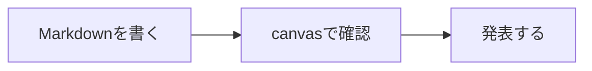

# presentation canvas
## Markdown でスライドを作る

このファイルを読みながら、canvas の操作とスライドの書き方を紹介します。

---

## まずは canvas を操作する

- **▶ / ◀**: 次のスライド、前のスライドへ移動
- **矢印キー**: `→` で次へ、`←` で前へ
- **☰**: スライド一覧を開いて、見たいページへジャンプ
- **⛶**: 外部ウィンドウで全画面プレゼンを開始
- **印刷アイコン**: デッキを 16:9 の PDF として保存

ページ送りは canvas 側で行われます。チャットから「3枚目へ」と指定することもできます。

---

## スライドは `---` で区切る

1つの Markdown ファイルに、複数のスライドを書けます。

スライドの終わりに、行頭から `---` だけを書きます。

```markdown
# 1枚目のタイトル

最初のスライドです。

---

## 2枚目の見出し

- ここから次のスライド
```

コードブロック内の `---` は、スライドの区切りとして扱われません。

---

## front matter で見た目を整える

スライドの先頭に、`---` で囲んだ設定を書けます。

```markdown
---
deck: はじめてのプレゼン
kicker: Getting started
page: 2
total: 6
---
## スライドの見出し

- ページ番号がフッターに表示されます
```

- `deck`: フッターに表示するデッキ名
- `kicker`: 見出しの上に表示するラベル
- `page` / `total`: ページ番号と総ページ数
- 先頭スライドに `layout: title` を付けると表紙になります

---

## Markdown をそのまま活用する

見出し、箇条書き、強調、リンク、表を組み合わせます。

| 記法 | 用途 |
| --- | --- |
| `## 見出し` | スライドの主題 |
| `- 項目` | 要点の整理 |
| `**太字**` | 重要語の強調 |
| `` `code` `` | コードや設定値 |

文章を詰め込みすぎず、1枚につき1つの主題にすると読みやすくなります。

---

## コードや図も表示できる

コードブロックには言語名を付けると、シンタックスハイライトされます。

```javascript
const slides = ["learn", "write", "present"];
console.log(slides);
```

Mermaid のコードブロックは、図としてレンダリングされます。


```mermaid
flowchart LR
    A[Markdownを書く] --> B[canvasで確認]
    B --> C[発表する]
```

---

## 画像とリンクを追加する

画像は `assets/` フォルダーに置き、絶対パスで参照します。

```markdown

```

外部ページへのリンクも Markdown の記法で書けます。

```markdown
[presentation canvas のリポジトリ](https://github.com/runceel/github-copilot-app-presentation)
```

画像には、表示できないときにも意味が伝わる説明文を付けます。

---

## テーマとサイズを選ぶ

デッキ全体のテーマは、canvas を開くときに指定します。

- `dark`: 落ち着いたダークテーマ（既定）
- `light`: 明るく中立的なテーマ
- `microsoft`: Fluent 配色
- `ms-modern`: Microsoft の新しいテンプレート風

特に強調したいページには、本文の先頭へ指定を追加できます。

```markdown
<!-- slide-size: large -->

## 大きく見せたいスライド
```

---

## 最小構成で始める

```markdown
# 私のプレゼン

---

## 今日伝えたいこと

- 要点を1つ
- 要点を2つ
- 最後に次のアクション
```

**書く → canvas で確認する → ページを送って発表する**。これだけで始められます。

---

## まとめ

- Markdown のファイルを `---` でスライドに分ける
- front matter でデッキ名、ラベル、ページ番号を設定する
- 箇条書き、コード、表、Mermaid、画像を組み合わせる
- canvas のボタンやキーボードで発表する
- 印刷アイコンから、プレゼン全体を PDF に書き出せる

まずはこのファイルをコピーして、自分のタイトルと要点に置き換えてみましょう。
