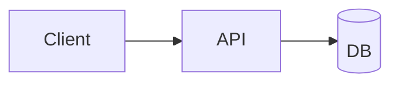

## Mermaid and Architecture DSL together



```architecture
{
  "version": 1,
  "title": "Print regression diagram",
  "description": "A minimal two-tier diagram used to verify PDF output.",
  "canvas": { "width": 1600, "height": 500 },
  "elements": [
    {
      "type": "group",
      "id": "app",
      "x": 60,
      "y": 60,
      "width": 900,
      "height": 380,
      "title": "Application",
      "layout": { "type": "row", "gap": 60, "padding": 60 },
      "children": [
        { "type": "node", "id": "gateway", "text": "Gateway", "icon": "api" },
        { "type": "node", "id": "worker", "text": "Worker", "icon": "server" }
      ]
    },
    {
      "type": "node",
      "id": "store",
      "text": "Storage",
      "icon": "database",
      "shape": "rounded-rect",
      "x": 1120,
      "y": 190,
      "width": 320,
      "height": 120
    },
    { "type": "connector", "from": "gateway", "to": "worker", "label": "enqueue" },
    { "type": "connector", "from": "worker", "to": "store", "routing": "orthogonal", "label": "write" }
  ]
}
```
