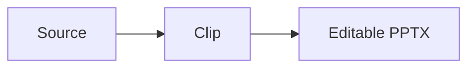
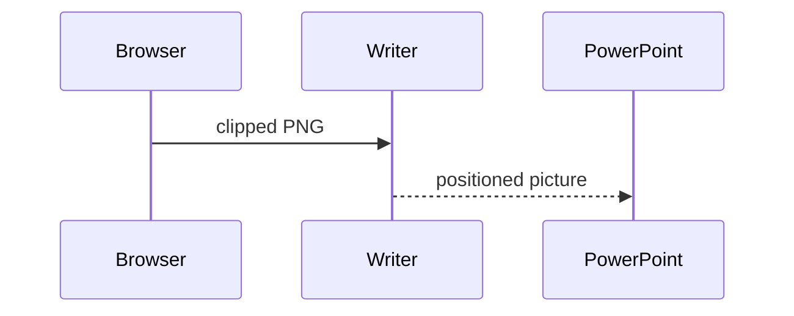

# PPTX fallback regions
## Layout-owned and element-sized artwork

Issue #111 manual regression deck

---

## No full-slide fallback

- Editable heading
- Editable paragraph and **emphasis**
- No kicker, image effect, diagram, or custom HTML

Expected: only the generated footer is cropped; no full-slide picture exists.

---
deck: Issue 111
kicker: Page decoration
page: 3
total: 9
size: normal
---

## One-digit page number

> Decorations are cropped to their painted bounds while the text stays editable.

The text remains editable above those pictures.

---
layout: center
deck: Issue 111
page: 10
total: 12
---

## Two-digit centered footer

The footer decoration keeps the measured width for `10 / 12`.

---
theme: light
---

## Multiple Mermaid regions

### Flowchart



### Sequence



Expected: two element-sized Mermaid pictures, not one full-slide picture.

---
size: normal
---

## Native PNG, SVG, GIF, and JPEG

**PNG** 
**SVG** 
**GIF 1x1 codec probe** 
**JPEG 1x1 codec probe** 

---

## Cropped and unsupported image rendering

**`object-fit: cover`**


**`object-fit: none`**


---

## Effects and arbitrary HTML

```js
const fallback = "shadow only";
```

| Native | Table |
| --- | --- |
| Text | stays editable |

<p style="width:70%;transform:rotate(1deg);background:#172554;border:2px solid #38bdf8;padding:8px">Rotated HTML fallback</p>

Expected: code and table shadows plus the transformed paragraph use bounded pictures.

---
theme: light
deck: Issue 111
page: 9
total: 9
---

## Horizontal rule and footer

Editable content above the rule.

<hr style="border-top:4px dashed #f97316">

Editable content below the rule.

Expected: the rule and footer are independent bounded fallback pictures.
